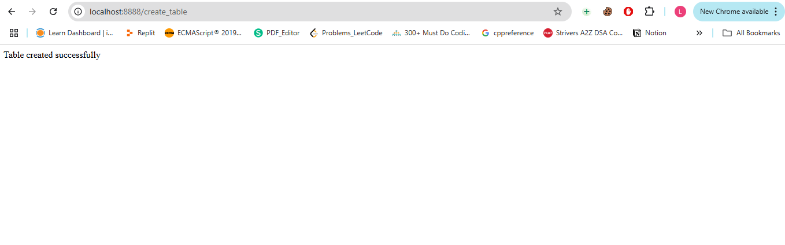
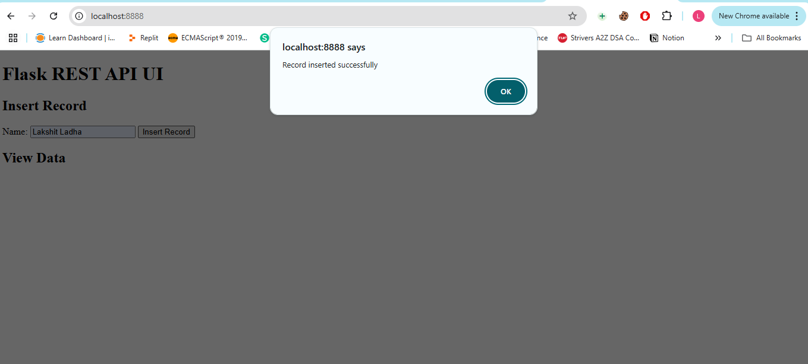
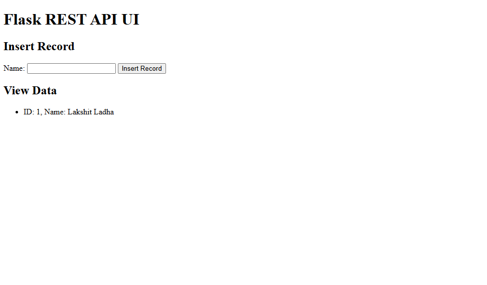

# Flask App on Kubernetes with MySQL Backend

This project demonstrates a complete deployment of a Flask web application using Kubernetes. The backend uses MySQL, and Docker images are pulled from AWS ECR using Kubernetes secrets.

## Project Structure

- Flask App: Python Flask app containerized using Docker.
- MySQL: Stateful MySQL database deployed inside the cluster.
- Kubernetes Resources:
  - Deployments for Flask and MySQL
  - Services for internal (MySQL) and external (Flask) communication
  - Secrets for storing database credentials securely
  - Persistent Volume Claims for MySQL
- Image Registry: AWS Elastic Container Registry (ECR)

## How It Works

### 🔁 Project Flow

1. **Kubernetes Setup**
   - Flask Deployment pulls the image using an ECR pull secret.
   - MySQL Deployment initializes the DB with a root user and password.
   - Flask app connects to MySQL using credentials from a Kubernetes Secret.
   - Services expose Flask app via NodePort or LoadBalancer.
  - Secrets ensure sensitive values are not hardcoded in config files.

2. **Accessing the App**
   - Use `minikube service flask-service -n flask-app-ns` to expose the service.
   - The app is available on a localhost URL like `http://127.0.0.1:PORT`.

---

## Handling DB Secrets

Create a secrets.yml file and update your db credentials in that file:
```yml
apiVersion: v1
kind: Secret
metadata:
  name: db-secret
  namespace: flask-app-ns
type: Opaque
stringData:
  MYSQL_ROOT_PASSWORD: <your_mysql_root_password>
  MYSQL_DATABASE: <your_mysql_database>
  MYSQL_USER: <your_mysql_user>
  MYSQL_PASSWORD: <your_mysql_password>

```


## Pulling Image from ECR
Make sure to create a Kubernetes pull secret for ECR access:

```bash
aws ecr get-login-password | docker login \
  --username AWS \
  --password-stdin <aws_account_id>.dkr.ecr.<region>.amazonaws.com

kubectl create secret docker-registry ecr-regcred \
  --docker-server=<aws_account_id>.dkr.ecr.<region>.amazonaws.com \
  --docker-username=AWS \
  --docker-password=$(aws ecr get-login-password) \
  --namespace=flask-app-ns
```

## Apply Kubernetes Files
```bash
# Create namespace
kubectl create ns flask-app-ns

# Apply secret 
kubectl apply -f secrets.yml

# apply PVC claim
kubectl apply -f mysql-pvc.yml


# Apply flask and mysql deployment 
kubectl apply -f deployment.yml
kubectl apply -f service.yml

# Apply flask and mysql service
kubectl apply -f flask-service.yml
kubectl apply -f mysql-headless.yml
```

## Port Forwarding
Use the following command to forward traffic from your local machine to the Flask service:

```bash
kubectl port-forward svc/flask-service 8888:80 -n flask-app-ns
```
Access the app at: http://localhost:8888

## Add MySQL User (if needed)
Open MySQL shell inside the pod:
```bash
kubectl get pods -n flask-app-ns
kubectl exec -it <mysql-pod-name> -n flask-app-ns -- sh
```

Access MySQL shell:
```bash
mysql -u root -p
# Enter password of root user
```

Create user (optional if not already created):
```sql
CREATE USER 'myflaskproj'@'%' IDENTIFIED BY 'myflaskproj';
GRANT ALL PRIVILEGES ON myflaskprojdb.* TO 'myflaskproj'@'%';
FLUSH PRIVILEGES;
```

## Access the Flask App
Open the browser and use http://localhost:8888, your flask app would be running.

 
 



