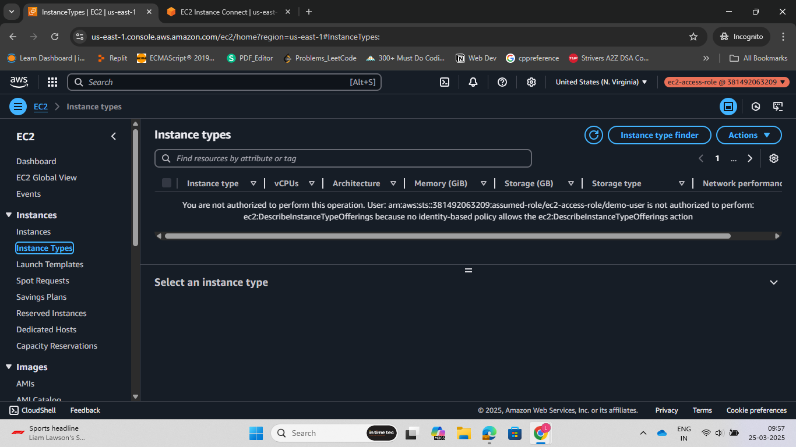
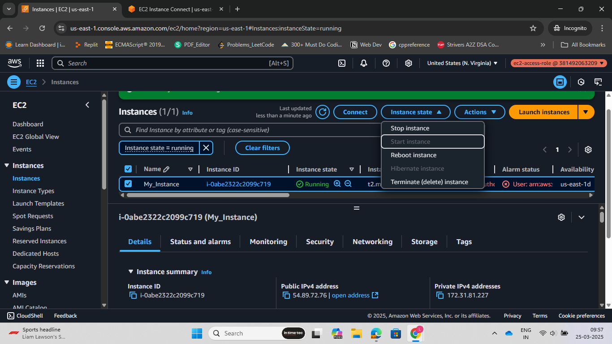
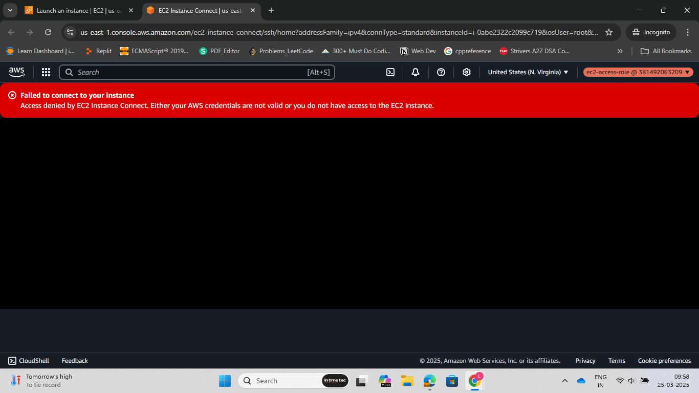

Steps:<br>

1. Go to AWS IAM and create a user. Remember, enable AWS console access for the user. Also, enable MFA(Multi-Factor Authenctication for IAM user).

2. In the AWS IAM, search for roles and click on create Role, and choose policy to attach to the role. I choosed a policy which allowed user to startan d stop a particluar EC2 instance and list all EC2 instances. Finally, click on create role.

3. Copy the ARN of the Role that we created in step2. Now, go the user that we created, and in add permissions, select create inline policy and edit the JSON:

```Javascript
{
    "Version":"2012-10-17",
    "Statement": [
        {
            "Sid":"Statement1",
            "Effect":"Allow",
            "Action":"sts:AssumeRole",
            "Resource":"arn_of_role"
        }
    ]
}
```
Click next, name the policy and click on create policy.

4. Go to teh role we created and copy the link to switch role in console.

5. paste this link in console and you will be able to login to console where the user has assumed the role created by us.







