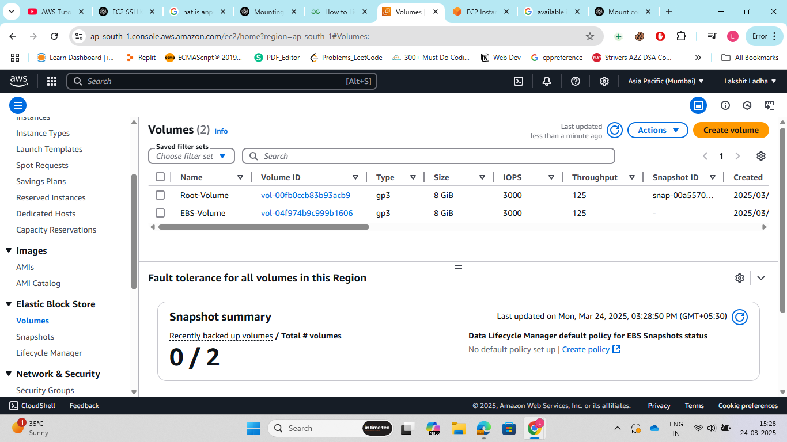
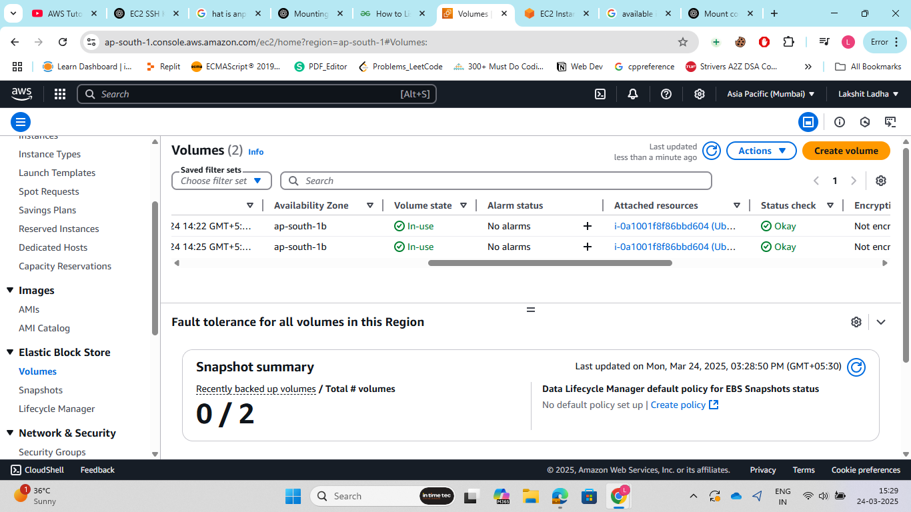
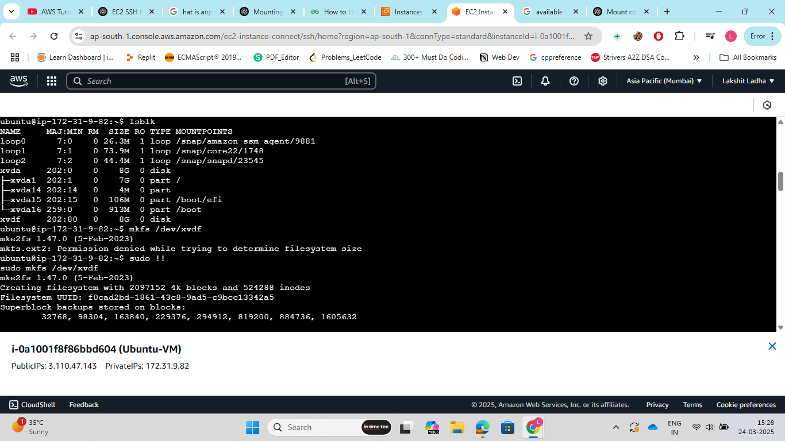
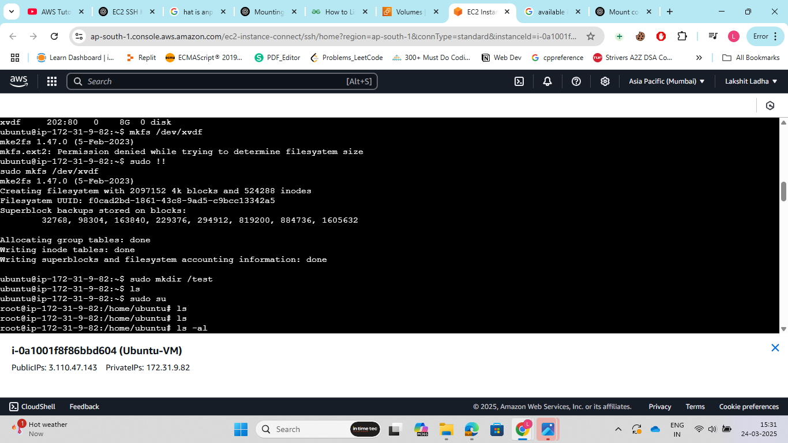
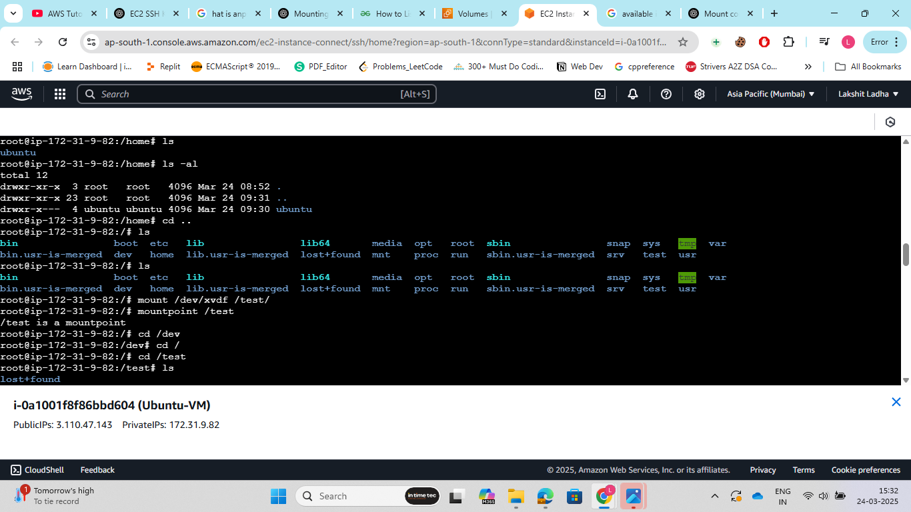

Steps:

1. Go to AWS Management Console and search for to EC2. Now, select EC2 and Click on Launch Instance. Choose an AMI (Amazon Linux, Ubuntu, etc.).
Select instance type something like t2.micro (for free tier). create a new key pair..

2. Now, Configure Storage and attach a 7 GB EBS Volume this volume is apart from root volume.

3. Configure Security Group (Restrict SSH to InTimeTec Network). Create a new security group. Allow SSH (port 22), and restrict it to InTimeTec’s IP range.

4. Launch the EC2 instance and Click Launch.

5. Connect to Your EC2 instance. And now mount the configured EBS volume. Use commands:<br>
 
> lsblk: to list all block devices<br>
> mkfs: this command is used to format the disk or partition with a specific filesystem.
```Bash
mkfs.ext4 [targetdevice]
```
>mount: this command is used to create to mount the EBS block












