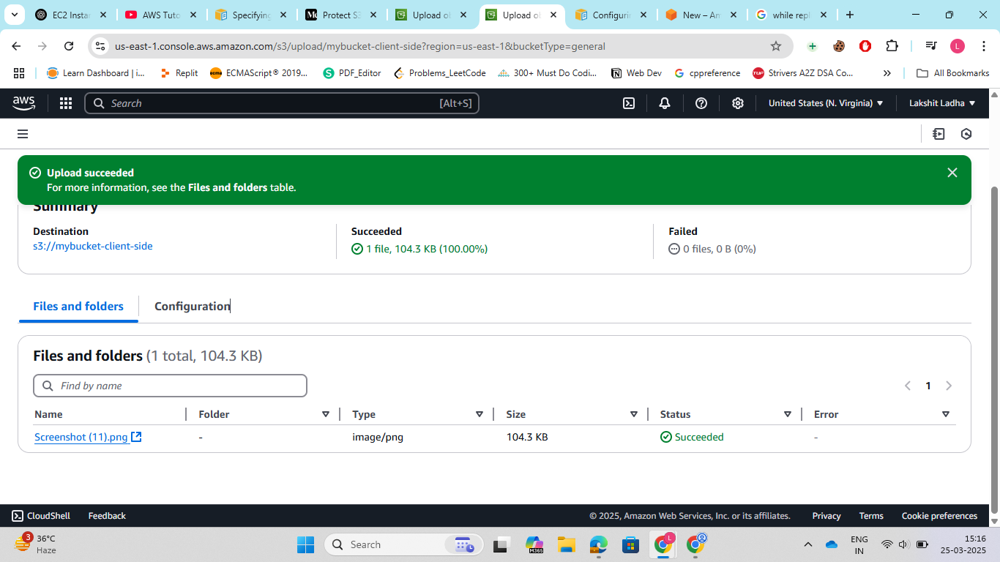

Steps:

1. Go to the AWS Management Console.Search for Amazon S3.Click on Create bucket.Enter a Bucket name. Under Object Ownership, keep ACLs disabled unless needed. nable Bucket Versioning by checking the box. And finally, click on create bucket.

2. Open the S3 bucket that we created in step1. Go to the Properties tab and to Default encryption. Choose AWS Key Management Service (SSE-KMS).Select a KMS key and click on Save changes.

3. Now, whenever we add an object to bucket it is encrypted.

