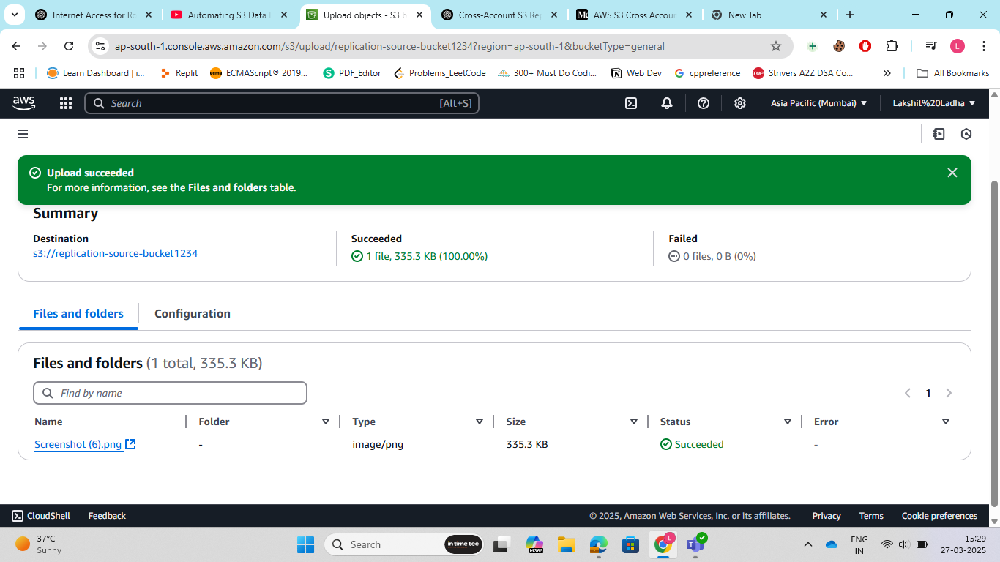
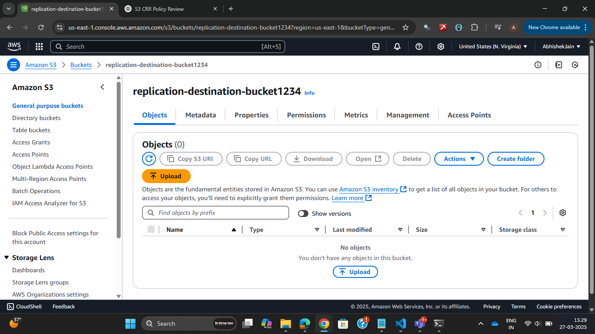
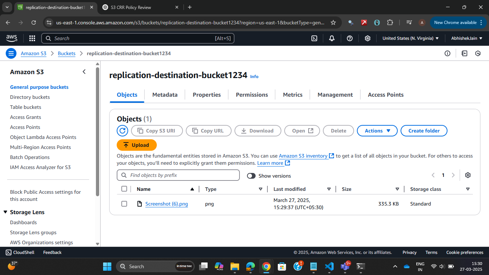
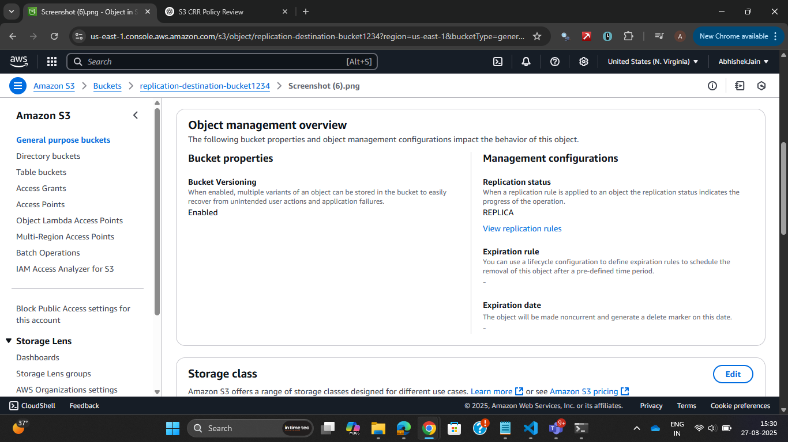

Steps:
1. Create a Destination Bucket in Account B. Navigate to Amazon S3. Click Create bucket and name the bucket as: "replication-destination-bucket1234".
Remember to enable Versioning. Click on Create bucket.

2. Similarly, Create a source Bucket in Account A. Navigate to Amazon S3. Click Create bucket and name the bucket as: "replication-source-bucket1234".
Remember to enable Versioning. Click on Create bucket.


3. Go to source account, open the bucket that we created. Got to management, then go to replication rules and create a replication rule. Name the replication rule, choose "apply to all objects in the bucket". Now, in destination choose "specify a bucket in another AWS account", Add account ID of destination bucket and also add the bucket name. Finally, choose create a new role and click on save. The replication rule will be created. NOw, copy the ARN of IAM role that has been created.

4. Go to destination bucket and edit the bucket policy in destination bucket.

```Javascript
{
    "Version": "2012-10-17",
    "Statement": [
        {
            "Sid": "Object Level Permissions",
            "Effect": "Allow",
            "principal":"arn_of_the_IAM_Role",
            "Action": [
                "s3:ReplicateObject",
                "s3:ReplicateDelete"
            ],
            "Resource": [
                "arn:aws:s3:::replication-destination-bucket1234/*"
            ]
        },
        {
            "Sid": "Bucket Level Permissions",
            "Effect": "Allow",
            "principal":"arn_of_the_IAM_Role",
            "Action": [
                "s3:List*",
                "s3:GetBucketVersioning",
                "s3:PutBucketVersioning"
            ],
            "Resource": [
                "arn:aws:s3:::replication-destination-bucket1234/*"
            ]
        }
    ]
}
and save changes.

4. Test the Replication by Uploading a new object to source-bucket. Check if it appears in destination-bucket after some time or not.







