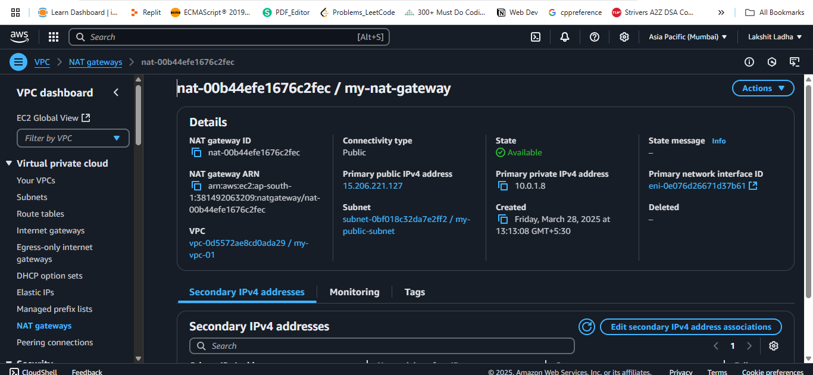
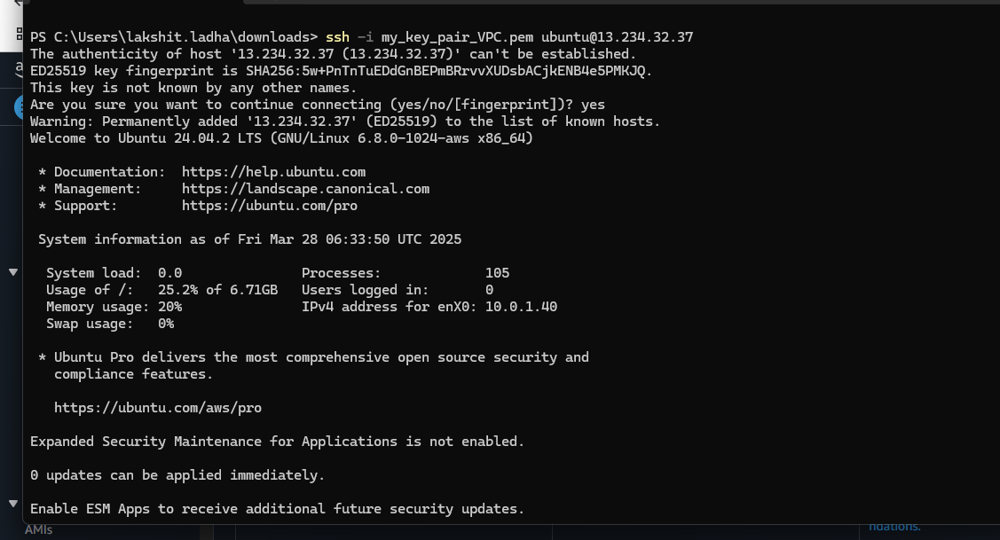
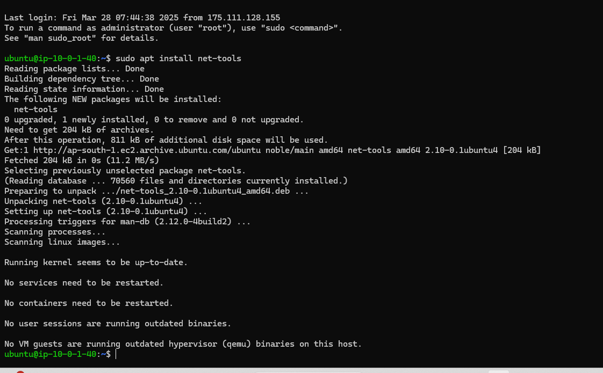
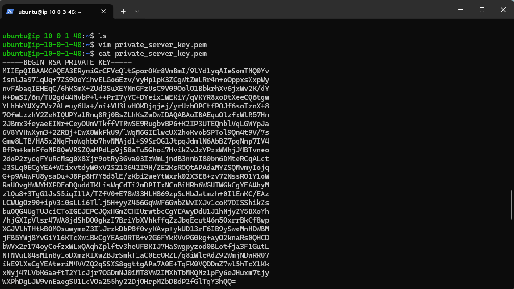
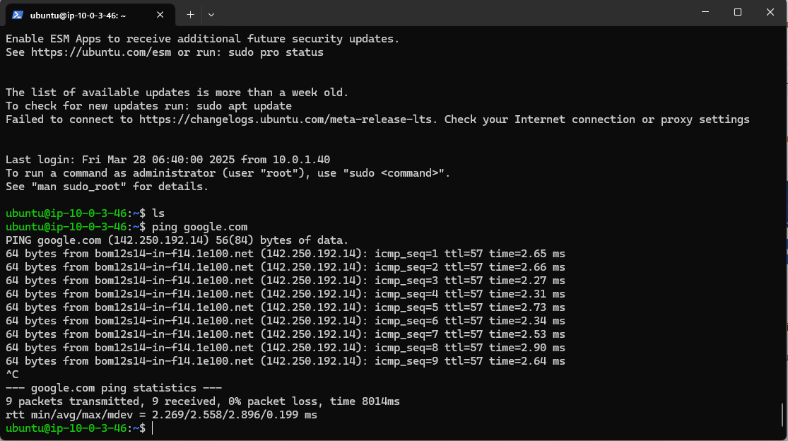
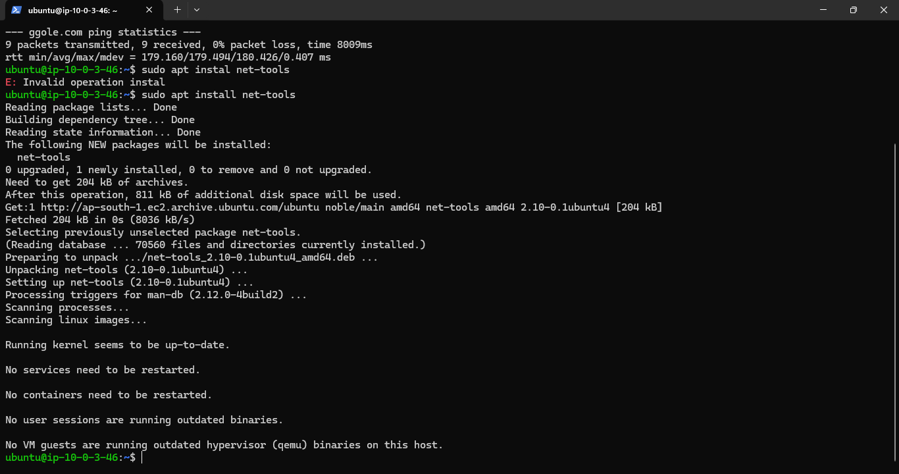

<!-- 
Launch a VPC with 2 Subnets (1 Public, 1 Private)
 -->

Steps:

1. Go to AWS management console, search for VPC and then create a VPC and allocate a CIDR range for that VPC. I choose CIDR as "10.0.0.0/16".<br>

2. Now create a Internet Gateway and associate to our VPC that we created in step1.<br>

3. Create 2 subnets, name one as "public" subnet and other as "private" subnet. Public subnet CIDR as: "10.0.1.0/24" and Private subnet CIDR as: "10.0.3.0/24".<br>

4. Create an EC2 instance, name it my "my-public-instance", choose the VPC that we created and also choose the public subnet that we created. Also, enable public IP address. Also, enable doing SSH into it from anywhere.<br>

5. Create an EC2 instance, name it my "my-private-instance", choose the VPC that we created and also choose the private subnet that we created. Also, enable doing SSH into it(specify,only from public subnet CIDR).<br>

6. Create a NAT gateway in public subnet and choose connectivity type as public.<br>


7. Now, create one public route table, associate it to public subnet and add a route to send all incoming traffic to IGW that we created.<br>

8. Now, create one private route table, associate it to private subnet. Go to edit route tables, add a route where destination is "0.0.0.0" and target is "NAT GATEWAY"(The one which we created) to access the internet.<br>

Steps to connect to private EC2 instance:

1. We need to connect to our public EC2 instance from our local system.Open the terminal of your system, go to downloads(as it contains the private key) and run:<br>

```Bash
ssh -i <private-key-file.pem> ubuntu@ip_address_of_public_ec2_instance
```


2. Now we have entered our public EC2 instance. Now, verify whether we have access to internet or not by ruuning:<br>
```Bash
sudo apt install net-tools
```


If we see packages been downloaded or we have access to internet, than it can be said we have access to internet.<br>

3. In our public EC2 instance create a file "private-key.pem" and copy the private key of your private EC2 instance into this file.<br>


Also change the permissions of this file to 400. Now, run:<br>

```Bash
ssh -i <private-key.pem> ubuntu@ip_address_of_private_ec2_instance
```


4. Now we are into our private EC2 instance. To verify whether we can connect to internet or not run:<br>
```Bash
ping google.com
```


or<br>

```Bash
sudo apt install net-tools
```


If we see packages been downloaded or we have access to internet, than it can be said we have access to internet.<br>


