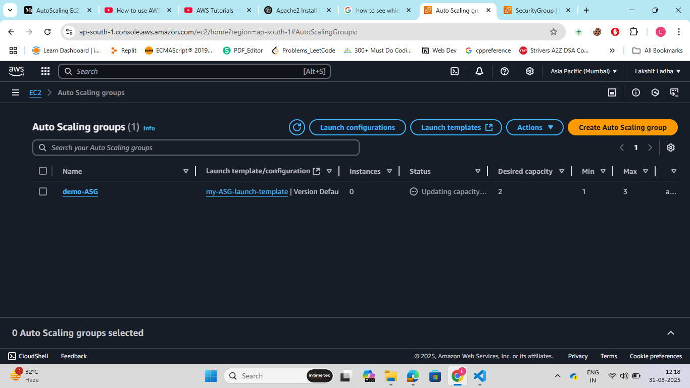
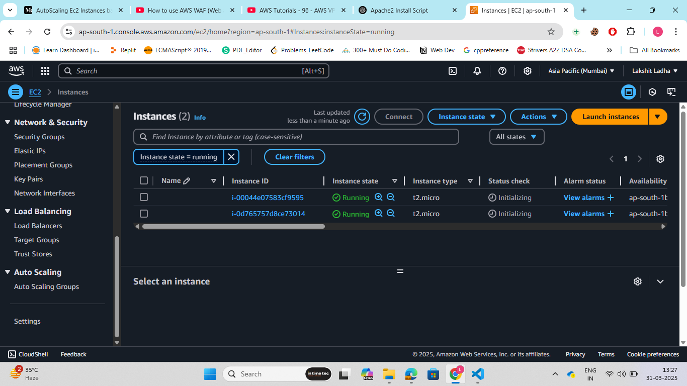

Steps:

1. Go to AWS management console, search for VPC. Now create a VPC. After creating a VPC, create a Internet Gateway and attach it to the VPC. Now, create 2 subnets, both in different availability zones. Now, create a route table, and attach this route table to both the subnets taht we created.
After this, edit route to anable access to IGW.

2. Go to EC2, and in the Load balancing section select target groups and create target Group. Name the target group, and choose the VPC that we created and keep remaining configurations as default. Click on create target group.

3. Final step is to create a Application Load Balancer and make it internet facing. Select the VPC that created. Create a security group for allowing access from internet. In listner and routing, select the target group that we created. And finally click on create LB.

4. Go to AWS management console, search for EC2. Now, look for launch template. Now, configure the launch template as per the your requirement.
Ensure, editing security group where you allow 'HTTP' ans well as 'SSH'. And in user details, add a shell script:

```Bash
#!/bin/bash
yes | sudo apt update
yes | sudo apt install apache2
echo "<h1>Server Details</h1><p><strong>Hostname:</strong> $(hostname)</p><p><strong>IP Address:</strong> $(hostname -I | cut -d' ' -f1)</p>" > /var/www/html/index.html
sudo systemctl restart apache2

```
And, finally click on launch template.

5. In ec2 dashboard, look for Auto Scaling and choose 'Auto Scaling Groups', create a ASG and choose the launch template that we created. Now, choose the VPC and subnet( if you have not created by your own choose default). Choose, desired, minimum and maximum capacity. Now, choose scaling policy to scale in/out based on CPU utilization. I choose 50% CPU utilization. And, finally click on create ASG group.

6. We can manually increase the CPU utilization of our system by using 'stress'package. SSH into the ec2 instance created by Auto Scaling Group.

```Bash
sudo apt-get install stress
stress -c 5 
```
By running above commands, our CPU utilization reaches above 50%, after few seconds we can see one more EC2 instance in our ec2 dashboard.

7. Copy the DNS name of load balancer and run on chrome to verify whether requests are forwarded to different servers or not.



