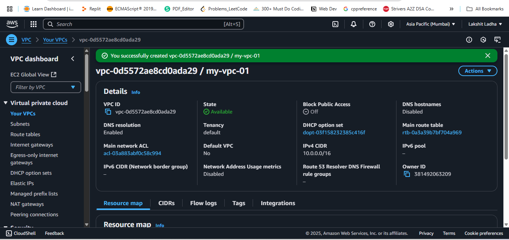
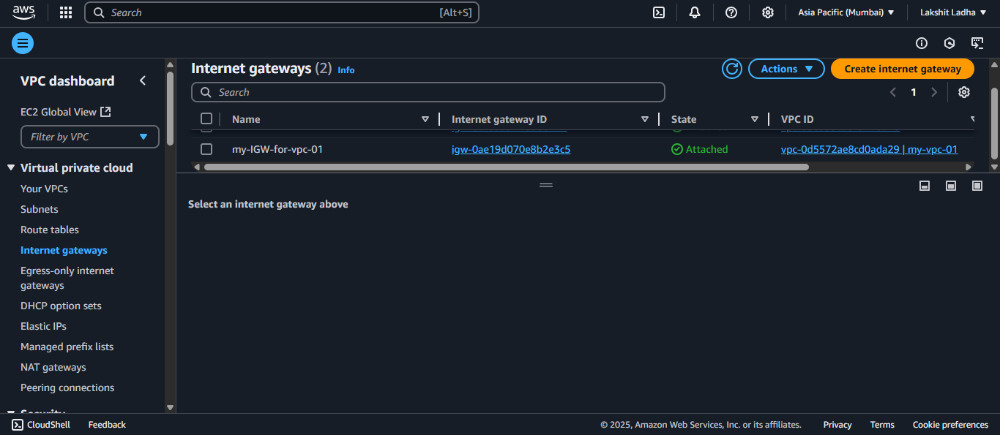
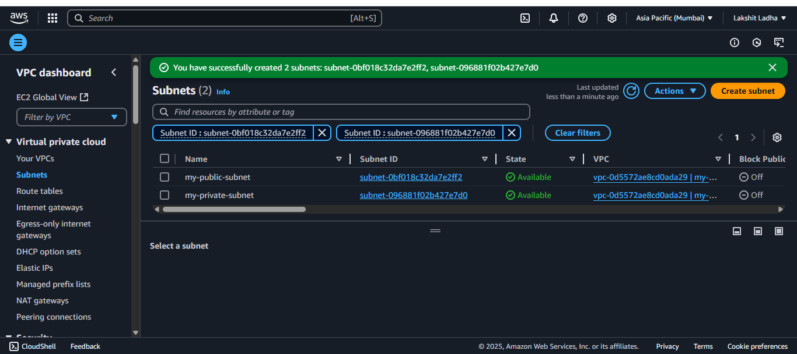
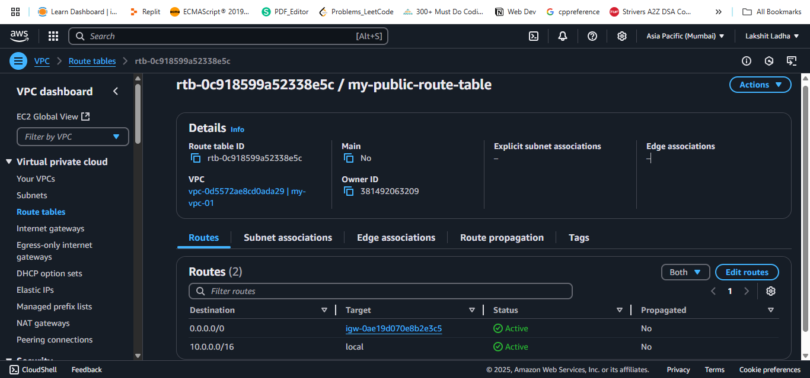
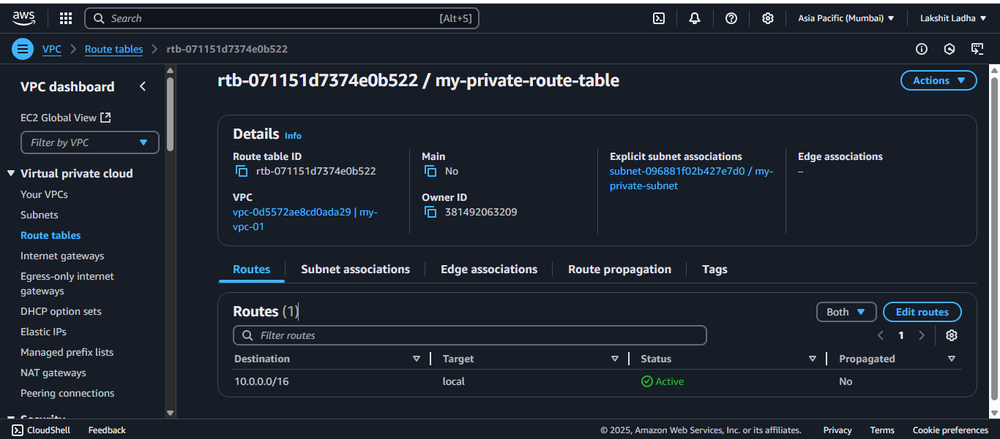

<!-- 
Launch a VPC with 2 Subnets (1 Public, 1 Private)
 -->

Steps:

1. Go to AWS management console, search for VPC and then create a VPC and allocate a CIDR range for that VPC. 

2. Now create a Internet Gateway and associate to our VPC. 

3. Create 2 subnets, name one as public subnet and other as private subnet. 

4. Now, create one public route table, associate it to public subnet and add a route to send all incoming traffic to IGW that we created. 

5. Now, create one private route table, associate it to private subnet, We don't need to add any routes as it is associated to private subnet. 

So after performing all these steps, our VPC will be ready with one public and one private subnet in it. 
