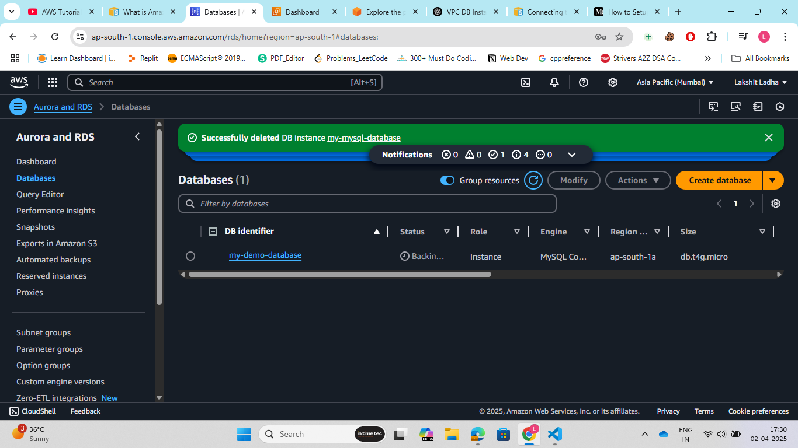
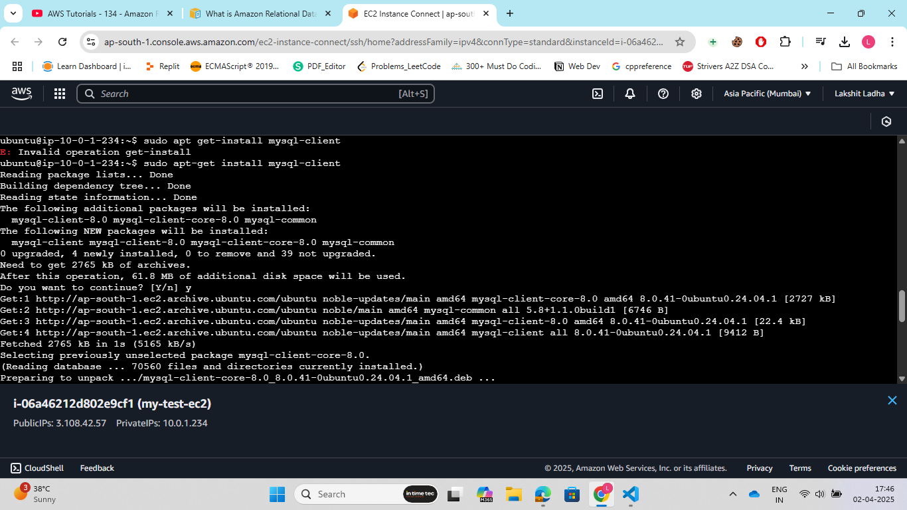
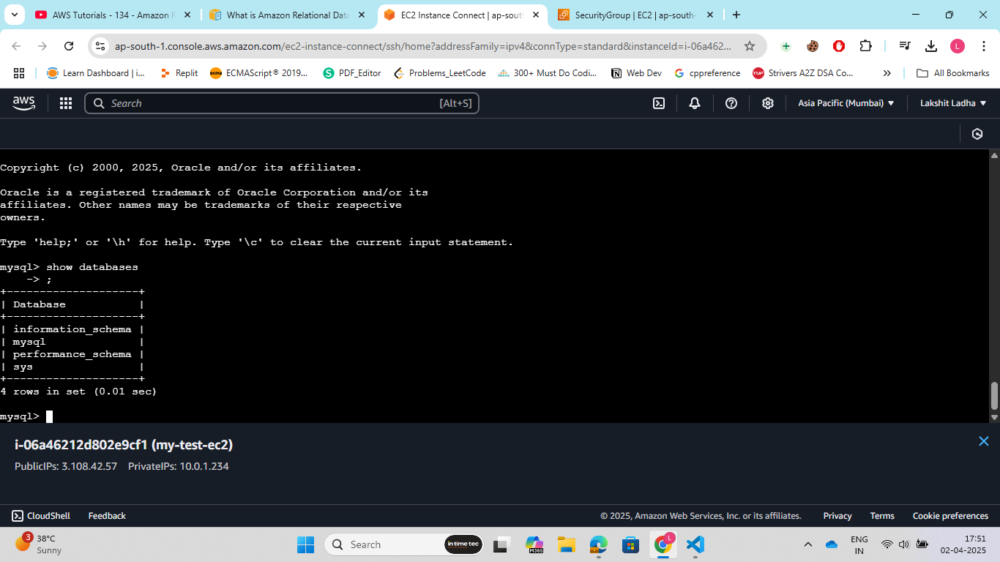
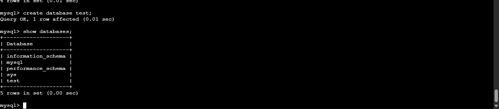

Steps:

1. Go to AWS management console, search for VPC and then create a VPC and allocate a CIDR range for that VPC.<br>

2. Now create a Internet Gateway and associate to our VPC.<br>

3. Create 3 subnets such that all are not in same availability zones, 2 for the database instances and one for creating EC2 instance to access database.<br>

4. Now, create an EC2 instance, create one public route table for the subnet in which ec2 instance is created,and add a route to send all incoming traffic to IGW that we created.<br>

5. Now, create one private route table, associate it to private subnet, We don't need to add any routes as it is associated to private subnet.<br>

6. Go to RDS, in databases select create Database, now choose a database creation method( I choose "standard create"). Now, Choose Database Engine(I choose MySQL), then choose the version of the database engine.<br>
Set a DB identifier (name for your instance). Create or use an existing master username and password. Choose the Virtual Private Cloud (VPC) and subnet group.
Choose public access (Yes/No) depending on it should be accessible over the internet.
Click on create database.<br>

7. SSH into the EC2 instance that we created, now install 'mysql-client' and login into your MySQL database instance.

```bash
sudo apt-get update
sudo apt-get install mysql-client
mysql -h <end_point> -u admin -p 
```
After running the last command, prompt will ask for your password. So, enter password and you are into you database.

 

 

 

