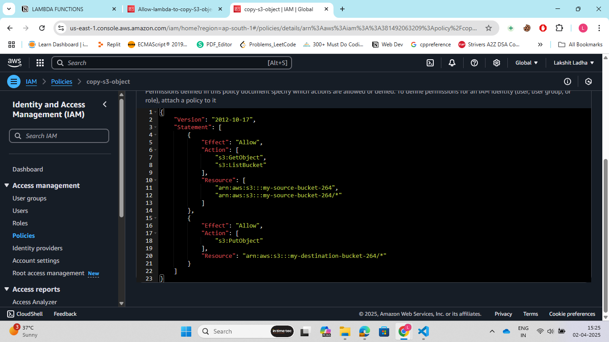
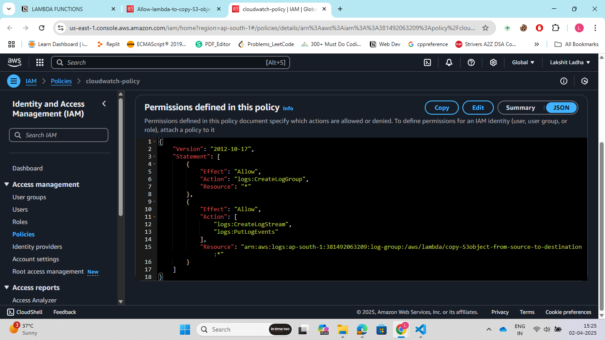
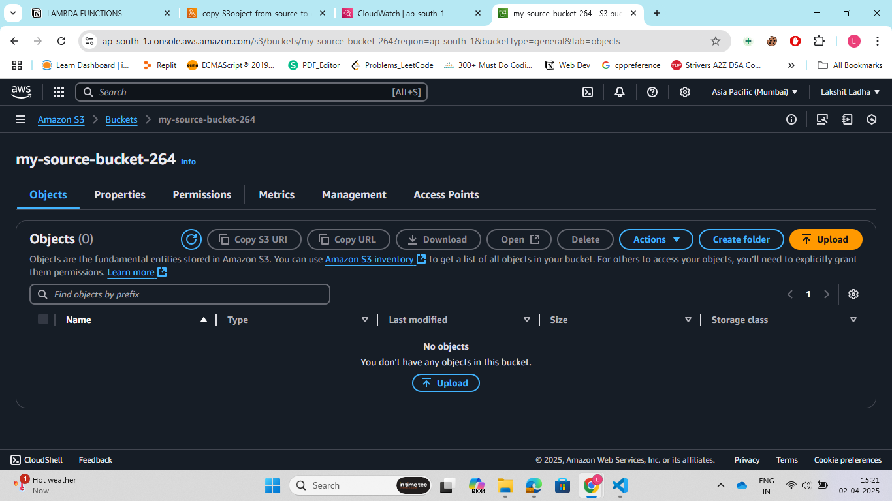
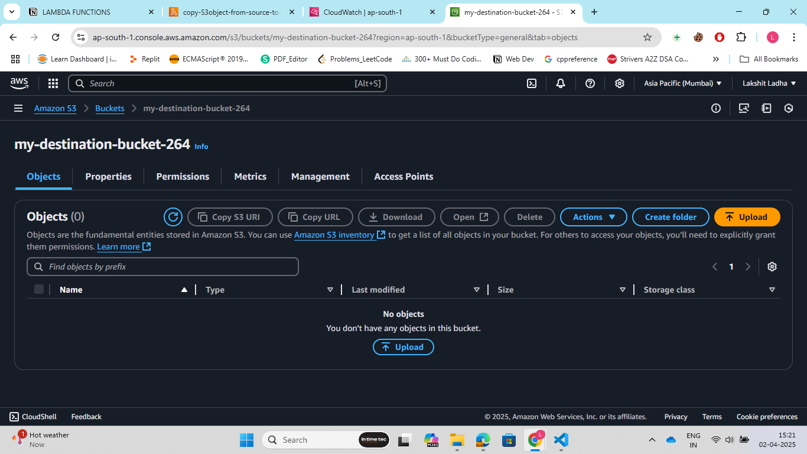
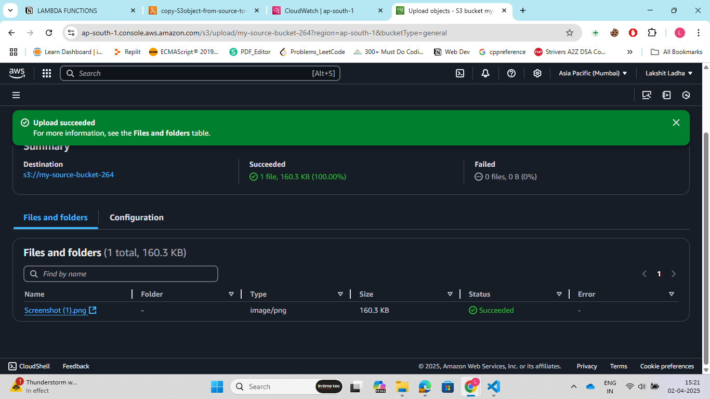
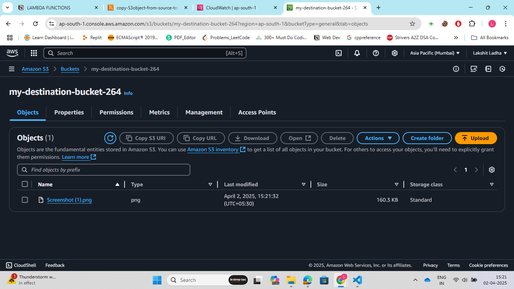
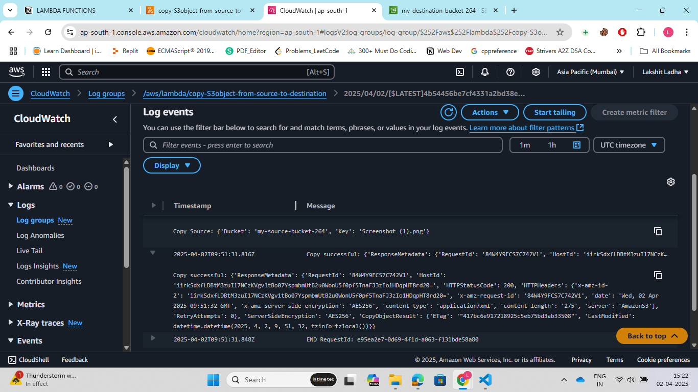

Steps:<br>

1. Go to the AWS Management Console. Search for Amazon S3. Click on Create bucket.Enter a unique bucket name for source bucket(must be globally unique). Select the AWS Region where you want to create the bucket.<br>

2. Repeat step1 to create a destination bucket.<br>

3. Go to IAM, search for IAM roles, nwo create a IAM role for AWS sevices and choose Lambda service for thsi role, and click on create role.<br>

4. Go to IAM and create 2 policies:<br>
> Bucket Policy: This allows to copy objects from source bucket and put them in destination bucket.<br>



> CloudWatch Policy: This allows us to view and list logs whenever we test our lambda function or the trigger is inoked.<br>



5. Go to IAM role that we created in step3 and attach the policies made in step4 to this role.

6. Now, in AWS management console search for Lambda, now create a lambda function and name this function according to you. Now, attach a trigger to this lambda function. Firstlly, choose S3 service, then the name of source bucket and choose the options on which trigger should be invoked.

7. Now, insert an image in source bucket to verify whether trigger is been invoked or not. If in the cloudwatch logs we see an log entry than the trigger is invoked.<br>

8. Now, edit default lambda function code, add a line before return statement to print the 'event' value. Now, repeat step7 and check logs, the "event" object value we appear as:<br>

```javascript
const obj = {
    'Records': [
        {
            'eventVersion': '2.1', 'eventSource': 'aws:s3', 'awsRegion': 'ap-south-1',
            'eventTime': '2025-04-02T08:32:58.245Z', 'eventName': 'ObjectCreated:Put',
            'userIdentity': {
                'principalId': 'ABV683KP6VS3A'
            },
            'requestParameters': {
                'sourceIPAddress': '175.111.128.155'
            },
            'responseElements': {
                'x-amz-request-id': 'MABXGTR66H56FAPC', 'x-amz-id-2': 'M8yGCOrryKF2GAgvTVNTBKnieGjWsDEpnsBuoQGt5WcrUJjIv7EPAlP/s9ne9QIP7wVWcLFlI7h2rwUVi5Verynvf/V4WcWVjSMbO9j1JWU='
            },
            's3': {
                's3SchemaVersion': '1.0', 'configurationId': 'eb17ab60-5967-4438-bd22-46f0d907353e',
                'bucket': {
                    'name': 'my-source-bucket-264', 'ownerIdentity': { 'principalId': 'ABV683KP6VS3A' },
                    'arn': 'arn:aws:s3:::my-source-bucket-264'
                },
                'object': {
                    'key': 'Screenshot+%283%29.png', 'size': 140349, 'eTag': 'ee4b1c0b9a351f94f5595684900960a8',
                    'sequencer': '0067ECF63A2FEE4D55'
                }
            }
        }]
}
```
This "event" object will help us to retrieve important information such as Object key and source bucket name which will be used in lambda function.<br>

9. Now, write the lambda function to copy the object from source bucket to destination bucket.<br>

```python

import json
import boto3
import urllib.parse

def lambda_handler(event, context):
    client = boto3.client('s3')

    source_bucket = event['Records'][0]['s3']['bucket']['name']
    object_key = urllib.parse.unquote_plus(event['Records'][0]['s3']['object']['key'])
    destination_bucket = 'my-destination-bucket-264'
    
    copy_source = {'Bucket': source_bucket, 'Key': object_key}

    try:
        response = client.copy_object(
            Bucket=destination_bucket,
            CopySource=copy_source,
            Key=object_key
        )

        print("Copy successful:", response)
        
        return {
            'statusCode': 200,
            'body': json.dumps('File copied successfully!')
        }
    except Exception as e:
        print("Error copying object:", str(e))
        return {
            'statusCode': 500,
            'body': json.dumps(f"Error: {str(e)}")
        }
```

10. Now, put an object in source bucket and verify whther it is copied to destination bucket or not.<br>

>Source Bucket intial:<br>


>Destination Bucket intial:<br>


>Source Bucket final:<br>


>Destination Bucket final:<br>


>Response in Cloudwatch log after trigger is called:<br>



