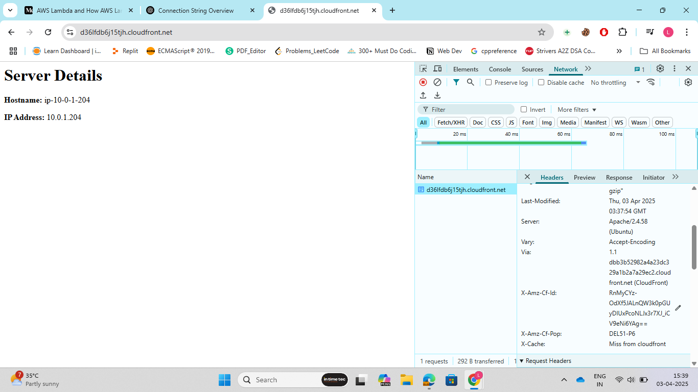
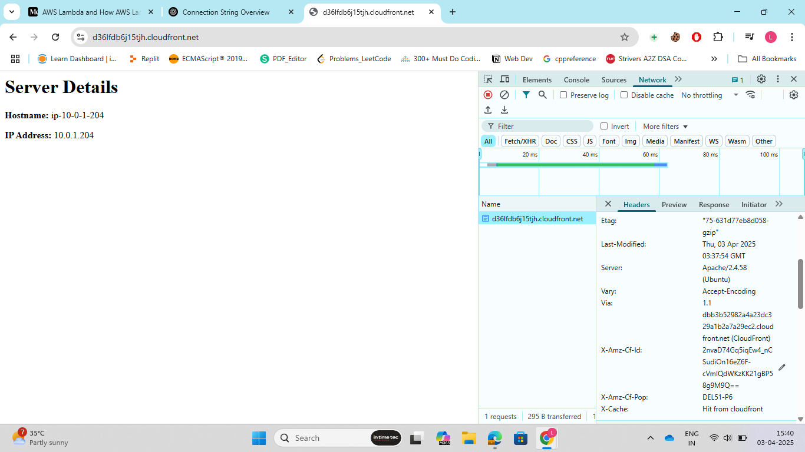

Steps:

1. Go to AWS Management Console, search for VPC and create a VPC. Select a CIDR range for you VPC, I selected 12.0.0.0/16<br>

2. Search for Internet Gateway, create a IGW and attach it to the VPC that we created in previous step.<br>

3. Create 2 public subnets and choose the same VPC for both subnets that we created in step1. Also, make the subnets available in 2 different zones, I selected:
   ap-south-1a
   ap-south-2b
The CIDR I selected for both subnets were:
   12.0.1.0/24
   12.0.3.0/24
<br>
4. Create a route table in the same VPC, and associate both the subnets to this route table. 
Now, create a route such that the subnets have access to internet.<br>

5. Now, create 2 EC2 instances, one-one in both the subnets.
The important part is the netwrok setting in each EC2 instance:<br>
   Choose the VPC we created.<br>
   For one instance choose one subnet and for other instance choose the left subnet.<br>
   Enable assigning public IP for both the instances.<br>
   Create a security group, such that apart from SSH we can also make HTTP request as we are going to install apache on these EC2 instances.<br>
   In userdata section, write the script to Bootstrap the EC2 instacne.<br>

``` Bash

#!/bin/bash
yes | sudo apt update

yes | sudo apt install apache2

echo "<h1>Server Details</h1>
<p><strong>Hostname:</strong> $(hostname)</p>
<p><strong>IP Address:</strong> $(hostname -I | cut -d' ' -f1)</p>" | sudo tee /var/www/html/index.html

sudo systemctl restart apache2

```
and finaly Launch instance.<br>

6. Verify whether apache has been installed on our EC2 instance or not, by using the public IP of EC2 instance and run it in chrome.<br>

7. Create a target group and club both EC2 instances in that, select the VPC that we created.<br>

8. Final step is to create a Application Load Balancer and make it internet facing.
Create a security group for allowing access from internet. And finally click on create LB.<br>

9. Now, setup a cloudfront. Go to AWS management console -> search for Cloudfront. Now, choose cloudfront and choose create distribution.
First choose an AWS origin, than create a cache policy. Disable WAF. Keep remaining option as it is. And, finally click on create distribution.
<br>



 
