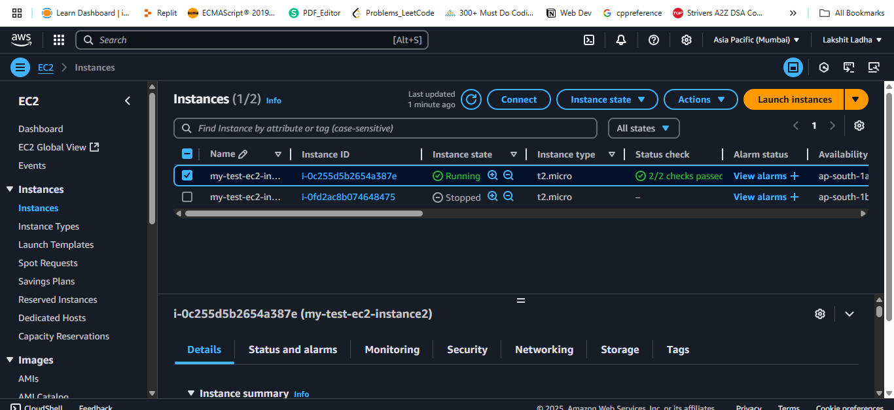
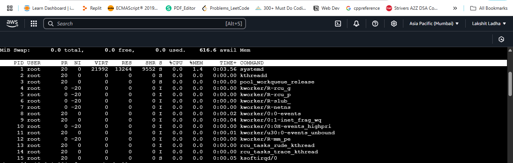
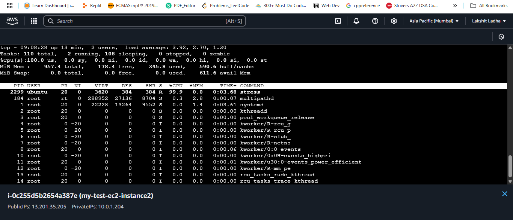
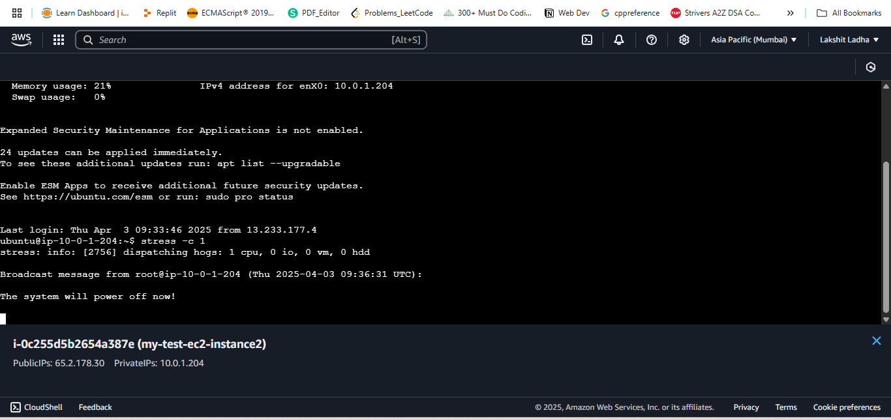
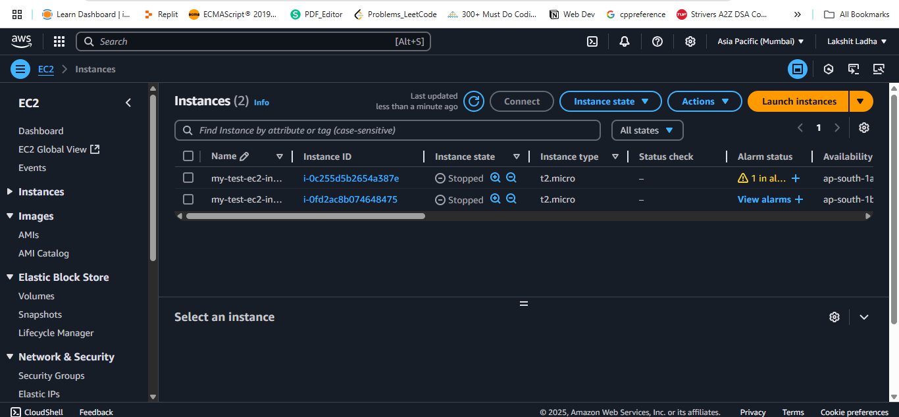
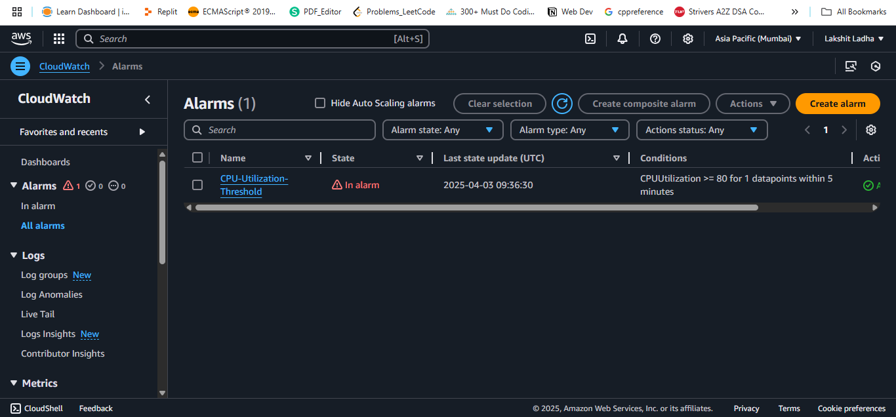
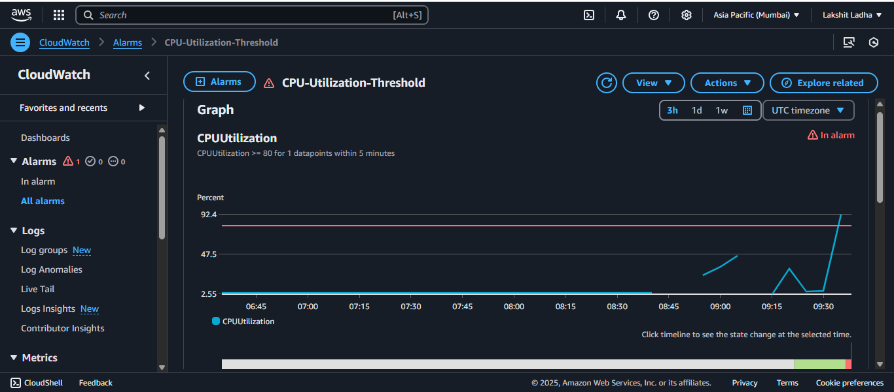

Steps:

1. Search for EC2, click Launch Instance. Name your instance (e.g., linux-ssh-only).Select Amazon Linux 2023 (Free tier eligible) or Ubuntu (Free tier eligible). Choose key-pair to SSH into EC2.
Network Settings (Allow only SSH). Allow SSH in security groups. Finally, click on Launch Instance.<br>



2. Create a SNS topic. Choose "Standard". Name the topic. Keep everythingbydefault and click on create topic.

3. Go to Subscription and then create subscription. Choose Tpoic ARN and select protocol(such as email, lambda, etc.). Now add the endpoint(such as emailId of the user whom we want to notify if CPU utilization goes above Threshold). And, finally, create on create Subscription.

4. Got to cloudwatch, then go to "All Alarms", now choose create Alarm. Then, select metrics and choose EC2. Now, select per-volume metrics. Add the EC2 instance Id and select CPU Utilization as Graphed Metrics. Click on create metrics.<br>
Now, choose greater than 80% and click next. Now, now add EC2 action(I choose stop EC2 instance if CPU Utilization goes above threshold). <br>
Now, name the alarm for email subject and add the body for email. Click next and finally, click on create Alarm.<br>

5. Now, SSh into your EC2 instance and run the following:<br>
Run 'top' command to see initial CPU utilization:<br>

 <br>

```Bash
sudo apt-get update
sudo apt install stress
stress -c 1
```
Now, run 'top' command, you will see CPU utilization going above 80%.<br>



Now, after few seconds the Ec2 instance will shutdown.<br>





 

