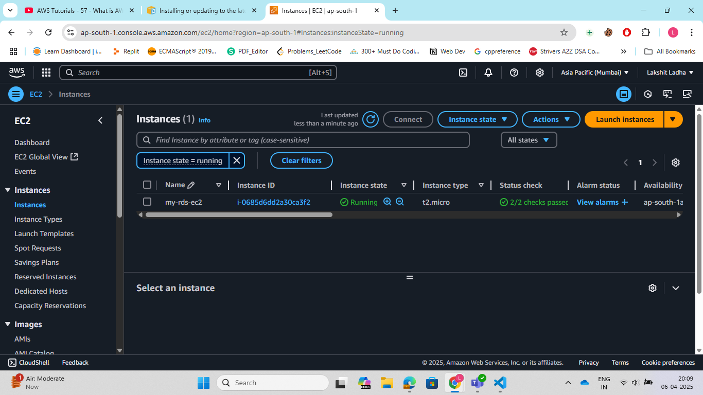
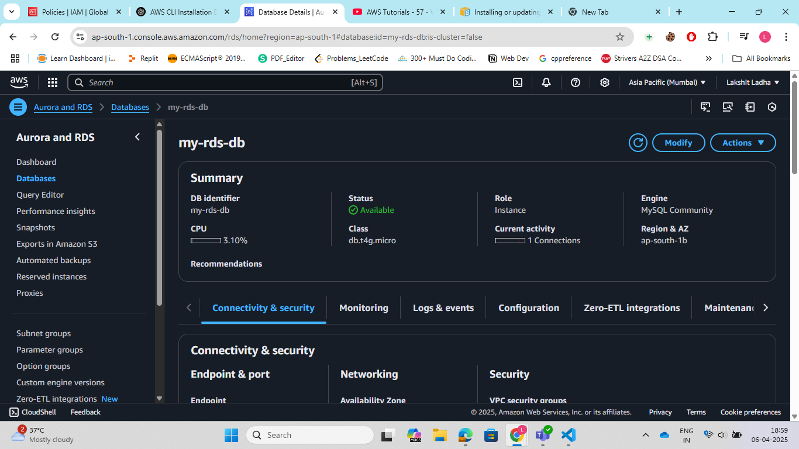
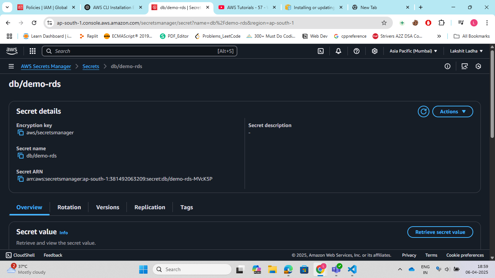
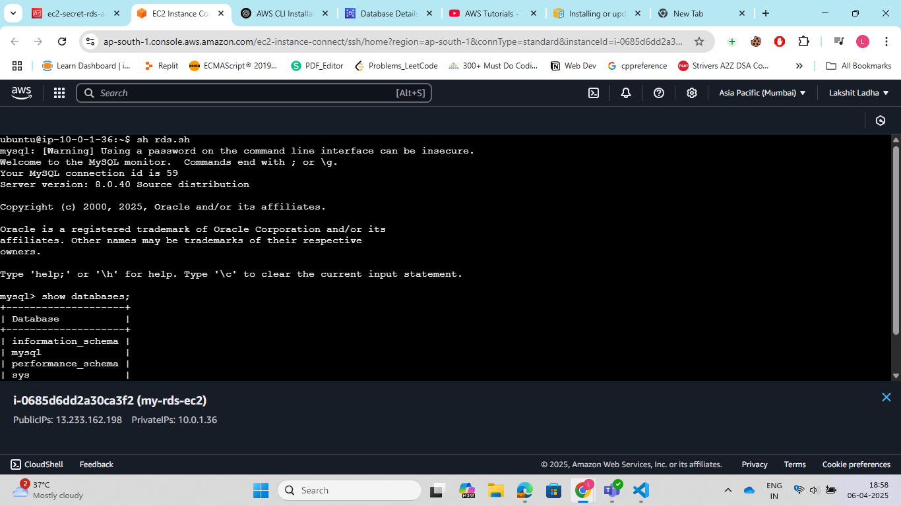

Steps:

1. Search for EC2, click Launch Instance. Name your instance (e.g., linux-ssh-only).Select Amazon Linux 2023 (Free tier eligible) or Ubuntu (Free tier eligible). Choose key-pair to SSH into EC2.
Network Settings (Allow only SSH). Allow SSH in security groups. Finally, click on Launch Instance.<br>
 

2. Search for RDS service and click on create DB instance, choose standard create and choose "MySQL". choose the latest version.Now, Choose free tier template. Now add your Username, and then password for your MySQl database instance. select the VPC, and don't allow public access. Finaally, click on create database.<br>
 

3. Search for secrets manager in AWS console. Select AWS secret manager service and click on create secret.Choose type of secret as RDS database.Add the username and password of our DB instance that we created in step-2. Finally, select the database, and name the secret according to you and click on save to create a secret.<br>


4. Search for IAM in AWS management console. Select IAM service, then role and click on create role. Select AWS service and then choose EC2 service and click on create role. The trust policy looks like:

```javascript
{
    "Version": "2012-10-17",
    "Statement": [
        {
            "Effect": "Allow",
            "Principal": {
                "Service": "ec2.amazonaws.com"
            },
            "Action": "sts:AssumeRole"
        }
    ]
}
```

5. Search for IAM in AWS management console. Select IAM service, then Policy and click on create Policy add the following Json and finally click on create policy.<br>

```javascript
{
    "Version": "2012-10-17",
    "Statement": [
        {
            "Sid": "Statement1",
            "Effect": "Allow",
            "Action": [
                "secretsmanager:GetSecretValue",
                "secretsmanager:ListSecrets"
            ],
            "Resource": "arn:aws:secretsmanager:ap-south-1:381492063209:secret:db/demo-rds-MVcK5P"
        }
    ]
}
```

6. Attach the created role to the EC2 instance created in step-1. Select the EC2 instance, click on actions and now select security and now finally, click on modify IAM role. Now, attach to the role that we created in step-4 and finally click on save changes.

7. Connect to EC2 instance by doing SSh into it. Now, run:
```Bash
sudo apt-get update
sudo apt install mysql-client
```

8. Run the following commands on EC2 instance to install aws-cli and then configure it:
```bash
sudo apt instal uzip
curl "https://awscli.amazonaws.com/awscli-exe-linux-x86_64.zip" -o "awscliv2.zip"
sudo unzip aws-cli
sudo ./install
aws --version
```

9. Now, create a file "rds.sh" and add the following script inside the folder:

```bash
#!/bin/bash

secrets=$(aws secretsmanager get-secret-value --secret-id 'secrets_name' --query 'SecretString' --output text)

username=$(echo "$secrets" | jq -r '.username')
password=$(echo "$secrets" | jq -r '.password')

mysql -h <endpoint_of_rds_instance> -u "$username" -p"$password"
```

10. Finally, run "sh rds.sh" and we will be inside the MySQl Db instance.

 

