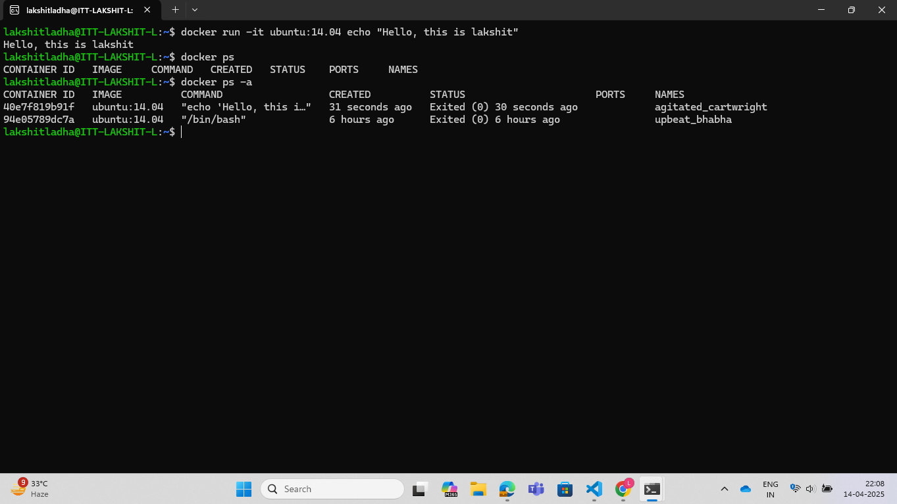

### docker run
> This command is used to run a command inside a container and close the container.<br>
> It basically starts a new container, abd runs a one-time command.<br>

#### Syntax:
```bash
docker run <image_name> <command>
```

##### Example:
```bash
docker run ubuntu echo "Hello Lakshit......"
```

