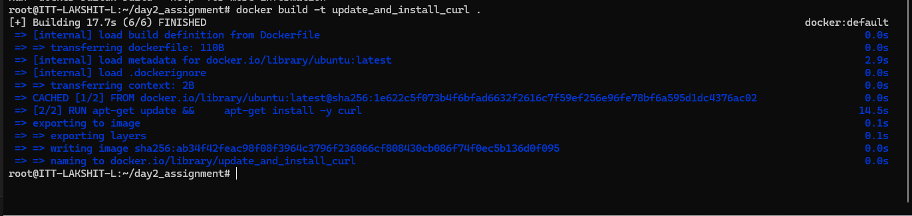
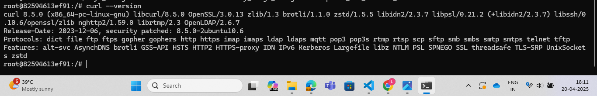

1. Create a folder named as "Day2_assignment", change directory to "Day2_assignment". And, now create a file named "Dockerfile" and add the following code:
```bash
FROM ubuntu:latest

RUN apt-get update && \
apt-get install -y curl
```

2. Now, build an image using the commands:
```bash
docker build --name update_and_install_curl .
```



3. Create a container using the image by runnning the command:
```bash
docker run -it --name my_image_assignment2 update_and_install_curl
```

and then inside the container run the command to verify whetehr curl has been installed or not:

```bash
curl --version
```
 