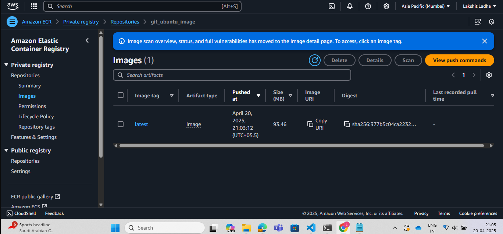
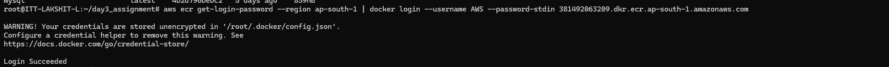
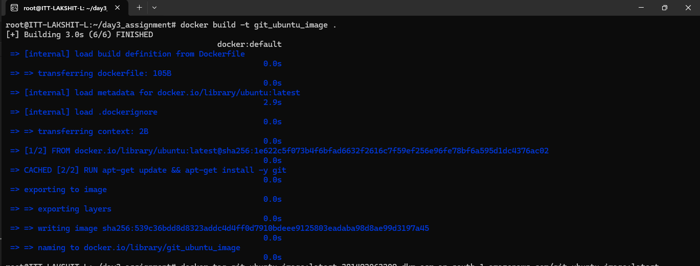
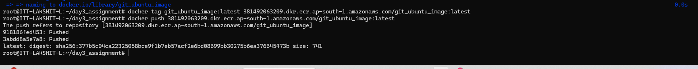
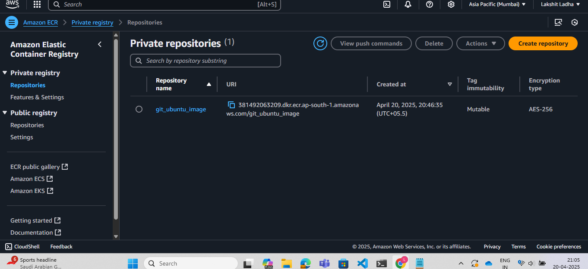

Steps:

1. Go to your AWS account and create an ECR repository, give our repository a suitable name.


2. Create a folder named as "Day3_assignment", change directory to "Day3_assignment". And, now create a file named "Dockerfile" and add the following code:<br>
```bash
FROM ubuntu:latest

RUN apt-get update && \
apt-get install -y git
```

3. Now, ensure that AWS is configured in your WSL CLI. If not install "AWS" and configure it. Use the following commands:
a> Installing AWS:<br>
```bash
curl "https://awscli.amazonaws.com/awscli-exe-linux-x86_64.zip" -o "awscliv2.zip"

sudo apt install unzip

unzip awscliv2.zip
```
Verify whether AWS is installed or not using:
```bash
aws --version
```
b> Configuring AWS:<br>
```bash
aws configure
```
Now, a prompt will appear. So, add Secret Key and Secret Access key.

4. Now, go to AWS console and open the ECR repository that we created. Select the repository and view push commands. And, use the stated commands to push the iamge to the repository.
```bash
aws ecr get-login-password --region ap-south-1 | docker login --username AWS --password-stdin 381492063209.dkr.ecr.ap-south-1.amazonaws.com

docker build -t git_ubuntu_image .

docker tag git_ubuntu_image:latest 381492063209.dkr.ecr.ap-south-1.amazonaws.com/git_ubuntu_image:latest

docker push 381492063209.dkr.ecr.ap-south-1.amazonaws.com/git_ubuntu_image:latest
```

 

 



5. Go to the repository and verify whether the "image" has been successfully pushed or not.


