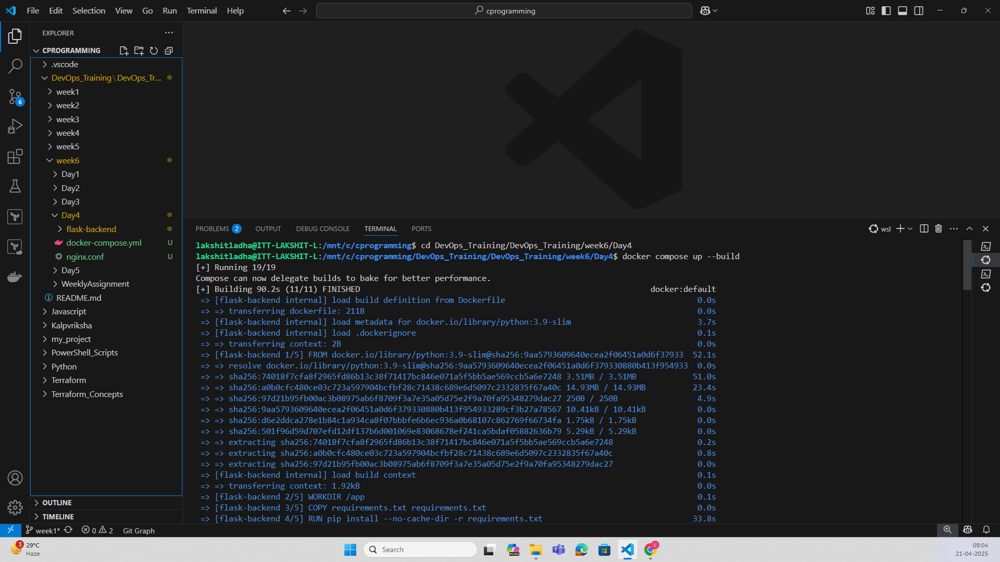
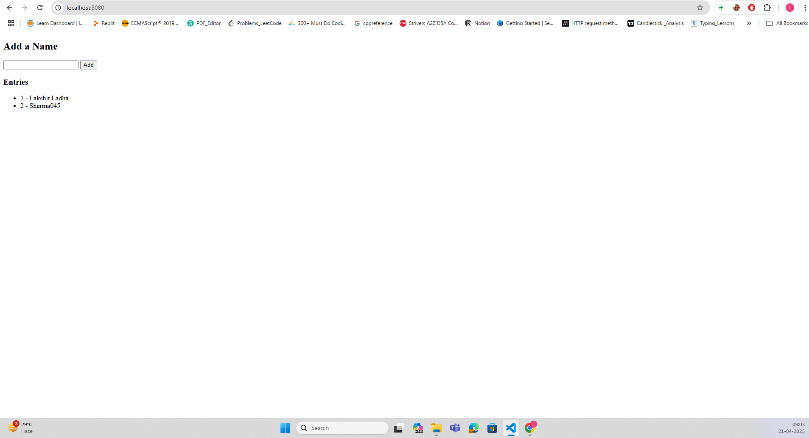
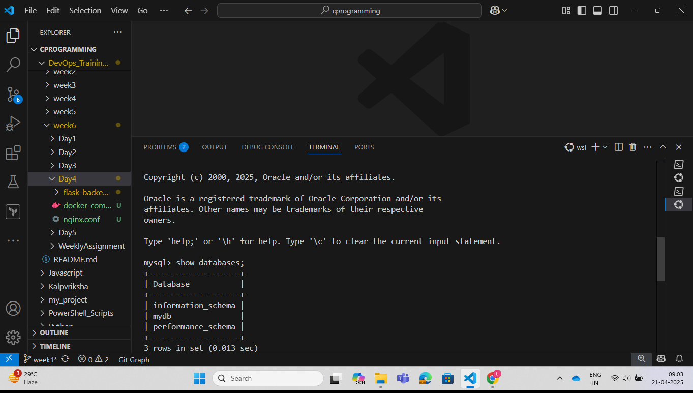
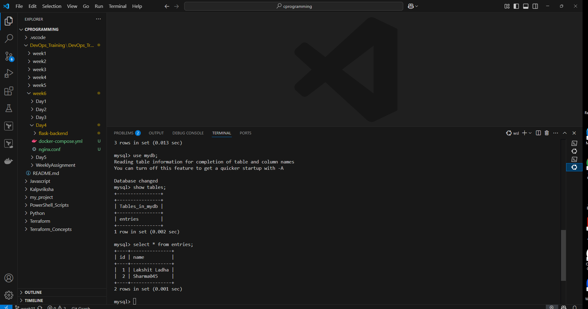

Steps:

1. Run the following command:
```bash
docker compose up --build
```


2. Open the browser and open "localhost:8000", amnd enter the details.


3. Login to your database to verify whether data has been inserted or not.
 

 