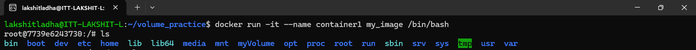
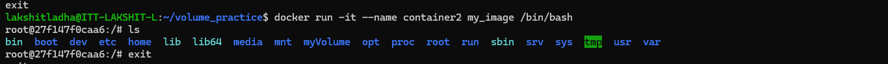

Steps:

1. Create a folder named as "Day5_assignment", change directory to "Day5_assignment". And, now create a file named "Dockerfile" and add the following code:
```bash
FROM ubuntu:latest

VOLUME ["/myvolume"]
```

2. Now, build an image using the commands:
```bash
docker build -t my_image .
```

3. Now, create a container from this image:
```bash
docker run -it --name container1 my_image /bin/bash
```

4. Now, create one more container and attach the volume to the newly created conatiner:
```bash
docker run -it --name container2 --privileged=true --volumes-from container1 ubuntu /bin/bash
```

5. Now, by running both the containers it can be verified that "myvolume" is attached to both the containers.

 

