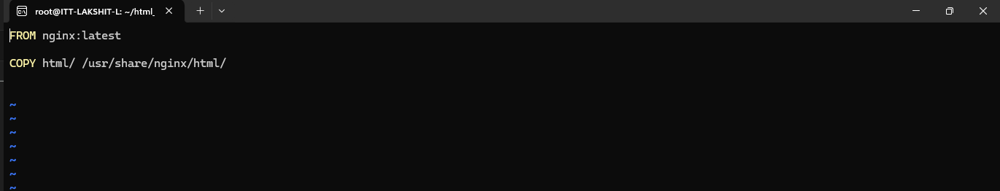
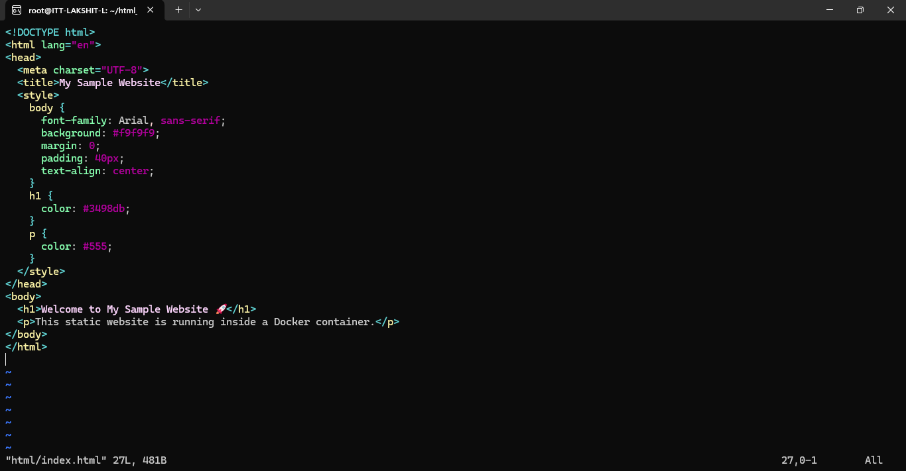
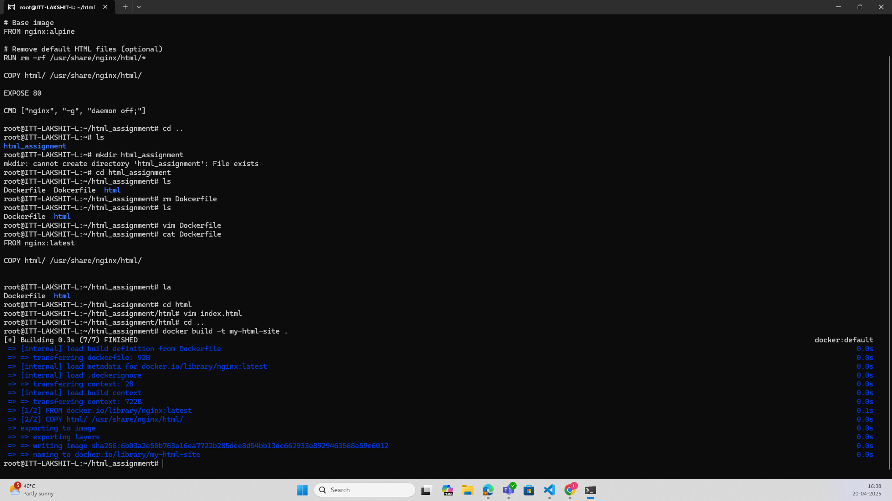
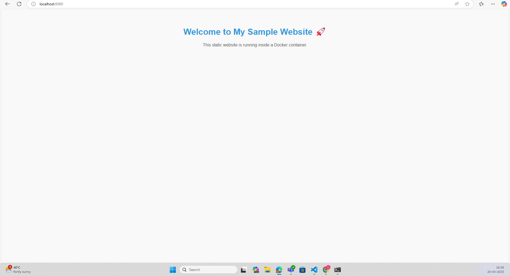

Steps:

1. create a directory "html_assignment", now change directory and reach to this directory. In this create, create a file named as "Dockerfile" and write the following: 
```bash
FROM nginx:latest

COPY html/ /usr/share/nginx/html/
```

 

2. Now, create a folder "html" and inside that folder create a file "index.html" and add the following code:
```html
<!DOCTYPE html>
<html lang="en">
<head>
  <meta charset="UTF-8">
  <title>My Sample Website</title>
  <style>
    body {
      font-family: Arial, sans-serif;
      background: #f9f9f9;
      margin: 0;
      padding: 40px;
      text-align: center;
    }
    h1 {
      color: #3498db;
    }
    p {
      color: #555;
    }
  </style>
</head>
<body>
  <h1>Welcome to My Sample Website 🚀</h1>
  <p>This static website is running inside a Docker container.</p>
</body>
</html>
```

  

3. Now, build the image using the command:
```bash
 docker build -t my-html-site .
```


 4. Now, create a container from the image using command:
 ```bash
 docker run -d -p 8080:80 --name my-html-sample-webapp my-html-site
 ```

5. Now, visit in browser on "http://localhost:8080", the html web-page will be displayed.

