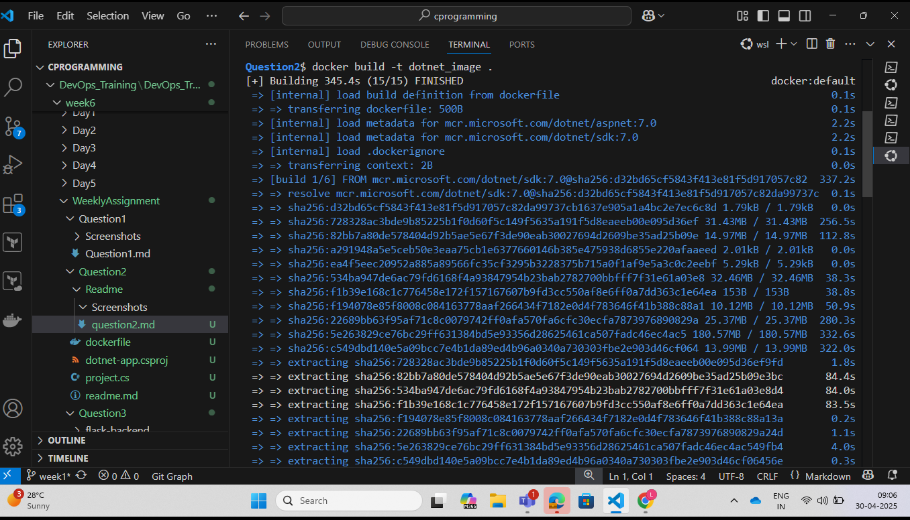
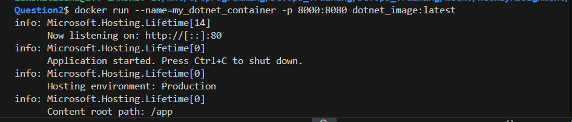
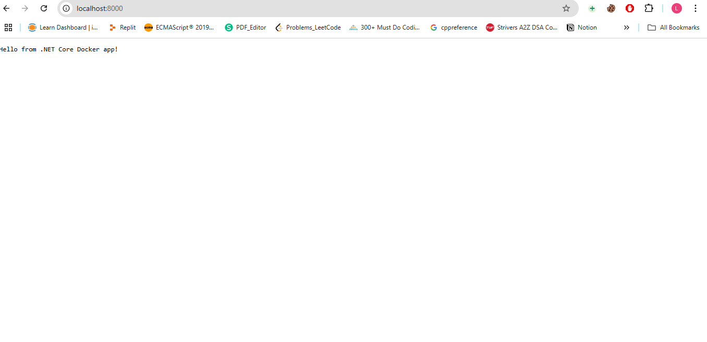

Steps:

1. Build the docker image using the commands:
```bash
docker build -t dotnet_image .
```
 

2. Now, create the container from the image that we build in step1
```bash
docker run --name=my_dotnet_container -p 8000:8080 dotnet_image:latest
```


3. Now go to your browser and search for "localhost:8000", you will be able to see you dotnet application running.

