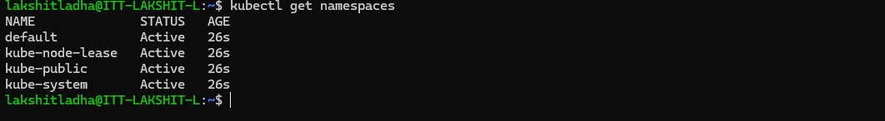
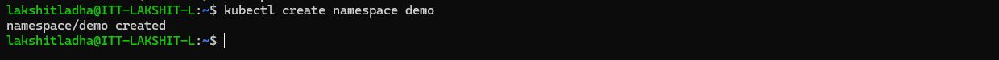
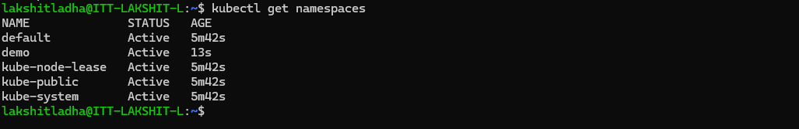
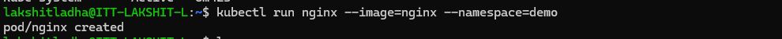
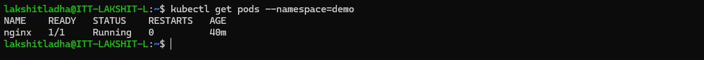

Steps:

1. Install 'minikube' using the commands:
```bash
curl -LO https://github.com/kubernetes/minikube/releases/latest/download/minikube-linux-amd64
sudo install minikube-linux-amd64 /usr/local/bin/minikube && rm minikube-linux-amd64
```

2. Now, install the 'kubectl' using the commands:
```bash
# Download the latest kubectl binary
curl -LO "https://dl.k8s.io/release/$(curl -L -s https://dl.k8s.io/release/stable.txt)/bin/linux/amd64/kubectl"

# Make it executable
chmod +x kubectl

# Move it into your PATH
sudo mv kubectl /usr/local/bin/
```

3. Now, use command:
```bash
minikube start --driver=docker
```

4. Create a namespace:<br>
i> First list all the current namespaces:
  

ii> Now, create namespace using the command:
```bash
kubectl create namespace <name_of_namespace>
```


iii> Verify whether the namespace has been created or not:

<br>

5. Create a pod and describe the namespace created in step4 so that pod is created inside that:


6. Verify whether the pod has been created or not:
