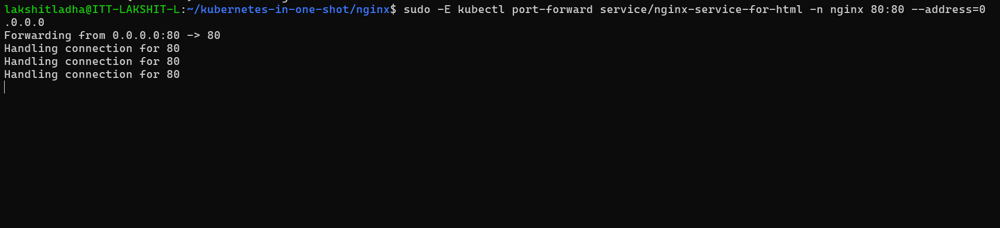
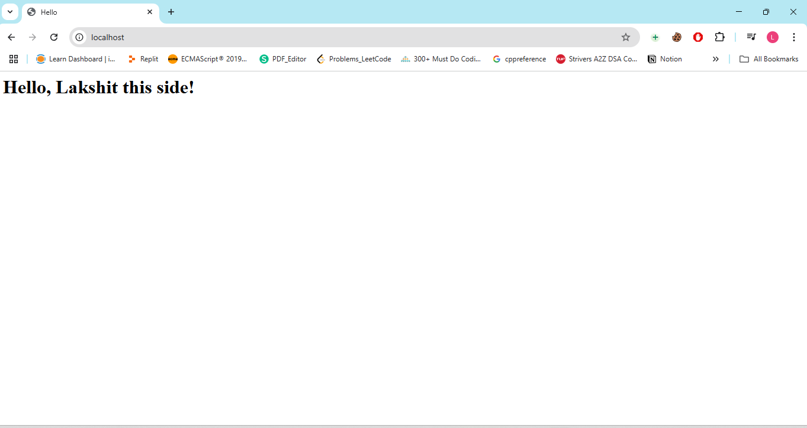

Steps:

1. Also create a confiMap.yml file to add html content to be served on page and run:
```bash
kubectl apply -f html-configmap.yml --namespace=nginx
``` 
2. Create a manifest file to create a pod and run:
```bash
kubectl apply -f pod.yml --namespace=nginx
```

3. Now, create a manifest file to create a service and run:
```bash
kubectl apply -f service.yml --namespace=nginx
```

4. Now, run the command:
```bash
sudo -E kubectl port-forward service/nginx-service -n nginx 80:80 --address=0.0.0.0
```


5. Go to browser and search for "localhost:80", HTML page will be served.
