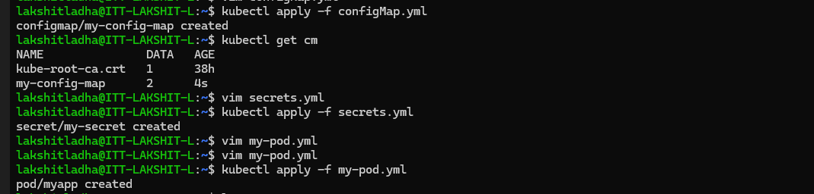
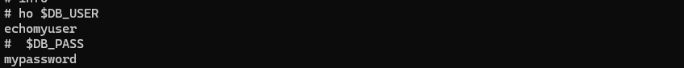

Steps:

1. Create a configMap file and add the required data, and the apply using commands:
```bash
kubectl apply -f configMap.yml
```

2. Create a secrets file and add the required data, and the apply using commands:
```bash
kubectl apply -f secrets.yml
```

3. Update the manifest file, now it can not be applied directly, delete the previous pod and recreate it, use command:
```bash
kubectl apply -f pod.yml
```
 

4. Now, go inside the container and check whether the config maps and secrets values are accessible or not.
