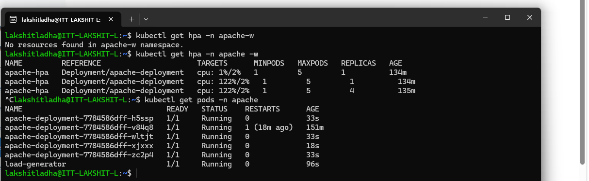

Steps:
1. Create a namespace apache using the command:
```bash
kubectl create namespace apache
```
 
2. Create a deployment.yml file and run command:
```bash
kubectl apply -f deployment.yml -n apache
```

3. Create a service.yml file and run command:
```bash
kubectl apply -f service.yml -n apache
```

4. Within minikube, metrics-server is available as a add-on. If it is not enabled already, you can enable it by running the following command:
```bash
minikube addons enable metrics-server
```

5. Create a hpa.yml file and run command:
```bash
kubectl apply -f hpa.yml -n apache
```
6. Now, expose the service:
```bash 
kubectl expose deployment apache-deployment --type=ClusterIP --port=80 --name=apache-service --namespace=apache
```

6. Now, check CPU utilization using:
```bash
kubectl get hpa -n apache -w
```

7. Now, generate the load:
```bash
kubectl run load-generator --image=busybox -n apache --restart=Never -it -- /bin/sh
```
Now, run:
```bash
while true; do wget -q -O- http://apache-service; done
```
8. Now verify whether autoscaling has occured or not, using:
```bash 
kubectl get pods -n apache
```
