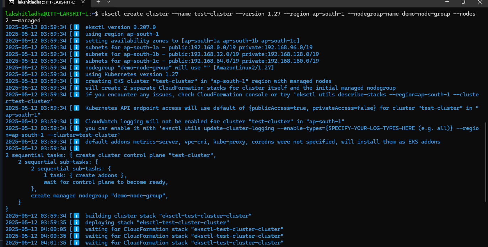
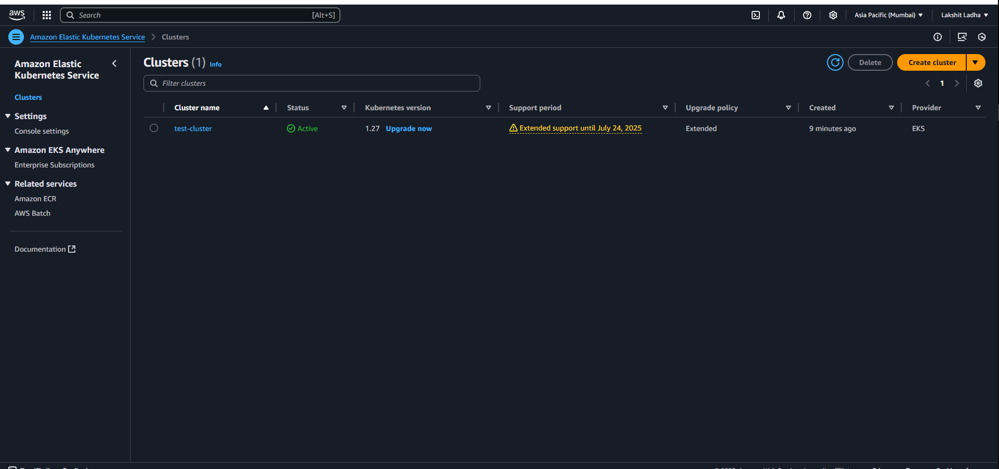
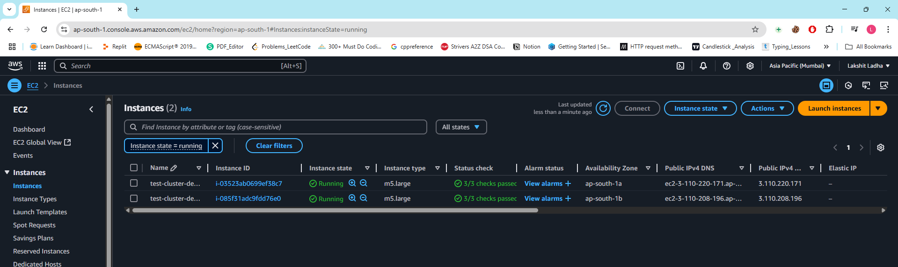

Steps:

1. Create a user that has eks acces roles and policy attached to it.

2. Now, Install aws cli if not installed.

3. Install kubectl if not installed

4. Install "eksctl" using:
```bash
curl --silent --location "https://github.com/weaveworks/eksctl/releases/latest/download/eksctl_$(uname -s)_amd64.tar.gz" | tar xz -C /tmp

sudo mv /tmp/eksctl /usr/local/bin
```

5. Now, run "aws configure" and configure the access keys & secret access keys on your local system:

6. Create public EKS cluster using eksctl command:
```bash
eksctl create cluster --name test-cluster --version 1.17 --region ap-south-1 --nodegroup-name demo-node-group --nodes 2 --managed
```
 

7. Now open your AWS acoount, got to EKS and verify whether the cluster has been created or not.
 

