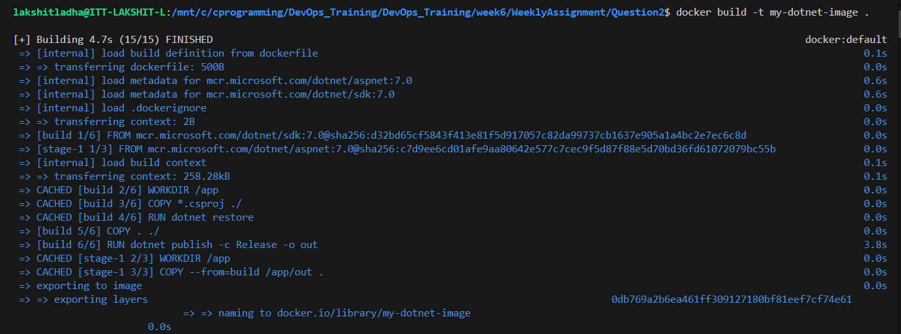
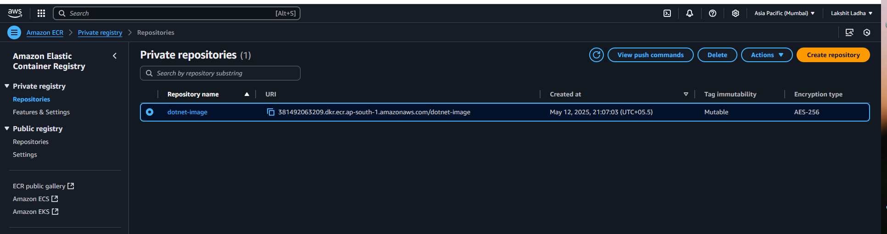
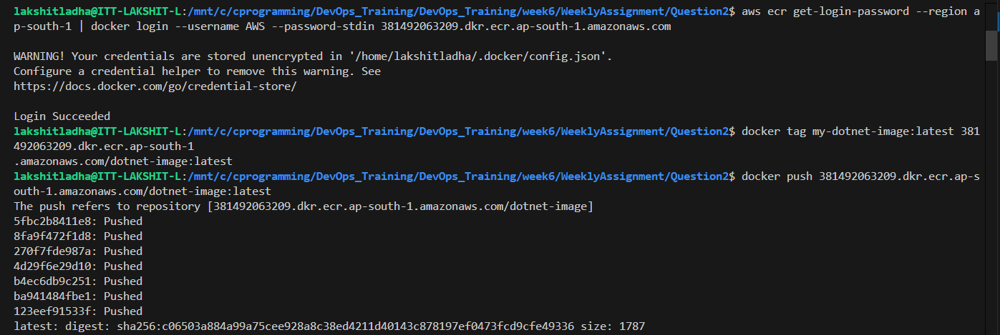
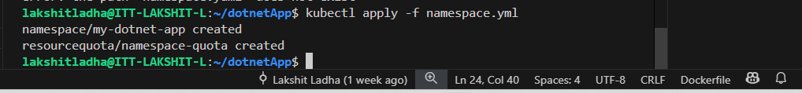
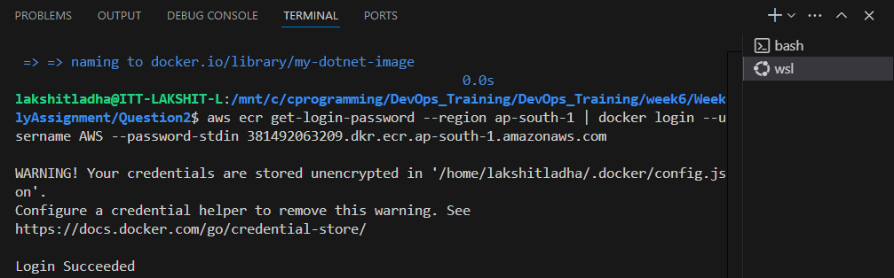
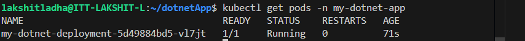
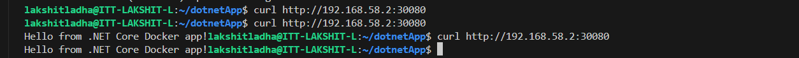

Steps:

1. Firstly create the docker iamge of you dotnet application using the command:
```bash
docker build -t my-dotnet-image .
```


2. Now, create an Elastic Container Registry(ECR) on your AWS account.


3. Now, go to the ECR repository and follow the push commands from AWS ECR:
```bash
aws ecr get-login-password --region ap-south-1 | docker login --username AWS --password-stdin 381492063209.dkr.ecr.ap-south-1.amazonaws.com

docker tag my-dotnet-image:latest 381492063209.dkr.ecr.ap-south-1.amazonaws.com/dotnet-image:latest

docker push 381492063209.dkr.ecr.ap-south-1.amazonaws.com/dotnet-image:latest
```


After all these steps, go to AWS console and verify whether image has been successfully pushed or not.

4. Now, start the minikube cluster using the command:
```bash
minkube start
```

5. Create a folder "dotnetApp" and change the directory to "dotnetApp", add all the maifest files in this folder.

6. Create a file "namespace.yml" and add manifest code for 'namespace' and 'resource-qouta', and then run command:
```bash
kubectl apply -f namespace.yml
```


7. Create a file "deployment.yml" and add manifest code. Since, the deployment pulls image from ECR repo which is private, we need to authenticate the Kubernetes to Amazon ECR. So, run:
```bash
aws ecr get-login-password --region ap-south-1 \ 
|docker login --username AWS --password-stdin 381492063209.dkr.ecr.ap-south-1.amazonaws.com
```


Now, run he command to create deployment:
```bash
kubectl apply -f deployment.yml
```


8. Now, create a service.yml file and run command:
```bash
kubectl apply -f service.yml
```

9. Now, from your local system:
```bash
curl http://192.168.58.2:30080
```
You will see an output: "Hello from .NET Core Docker app!"
