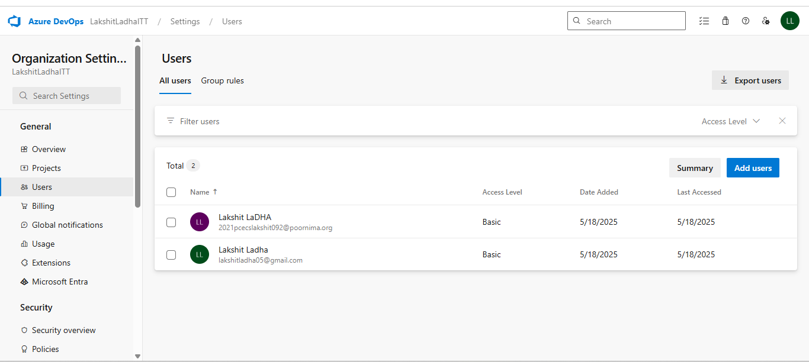
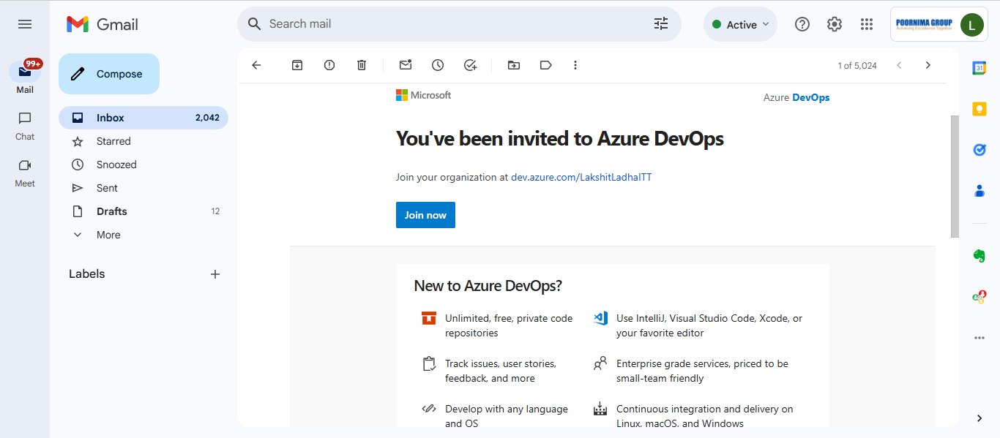
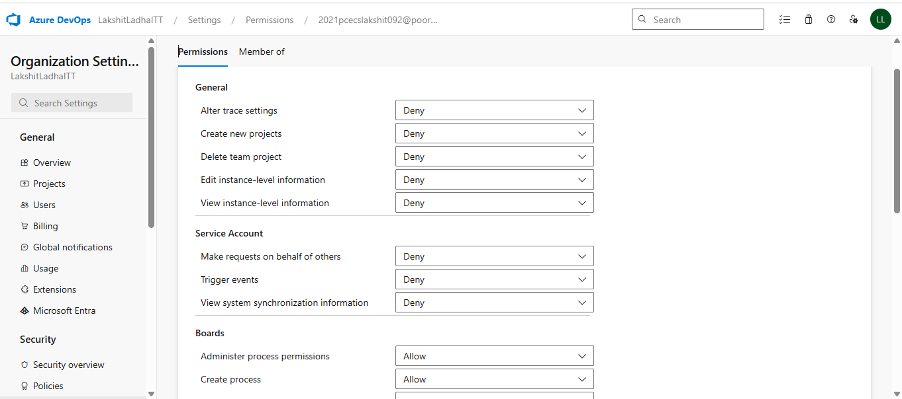
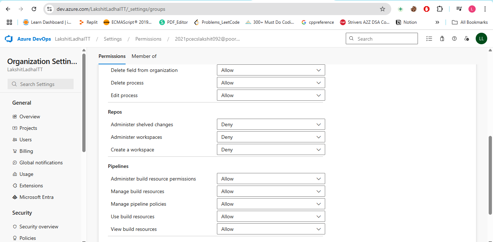
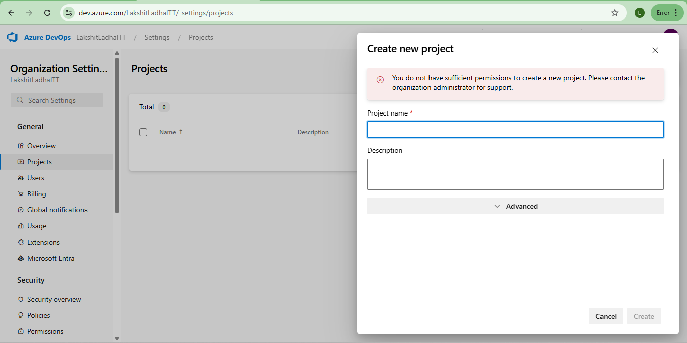

Steps:

1. Got to Azure Devops Dashborad and then click one organization settings.
Select organizational settings, under "General" section click on Users. Now, click on add users, and add the user email and give basic Access level.

2. Now, to verify whether user has been added or not, check the email you enterd and verify whether email has been recieved or not.
 

3. Under organizational settings, go to "security", then select Permission and click on users, and choose the user and modify the permissions. Allow user with only boards and pipeline permissions.

4. Now use the link received on email and login using email address, and try 
to create a new project and you will denied.
