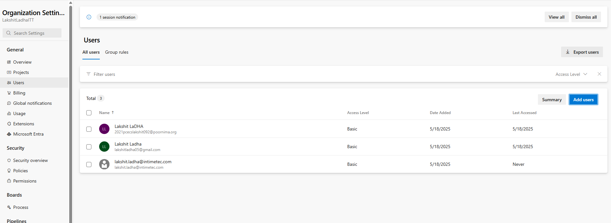
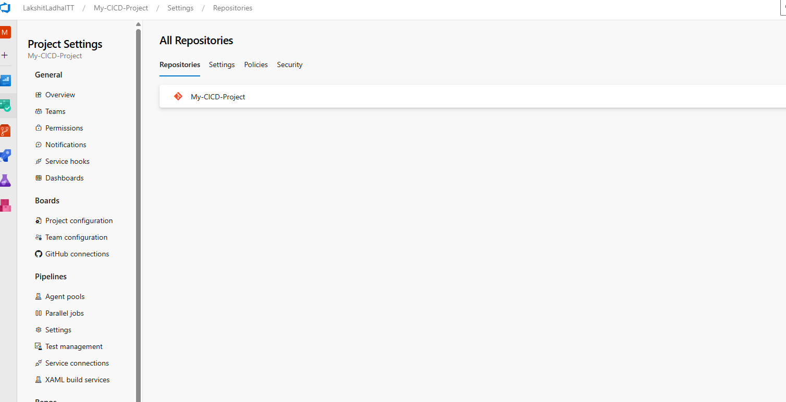
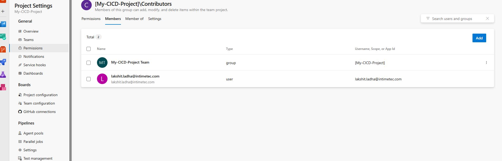
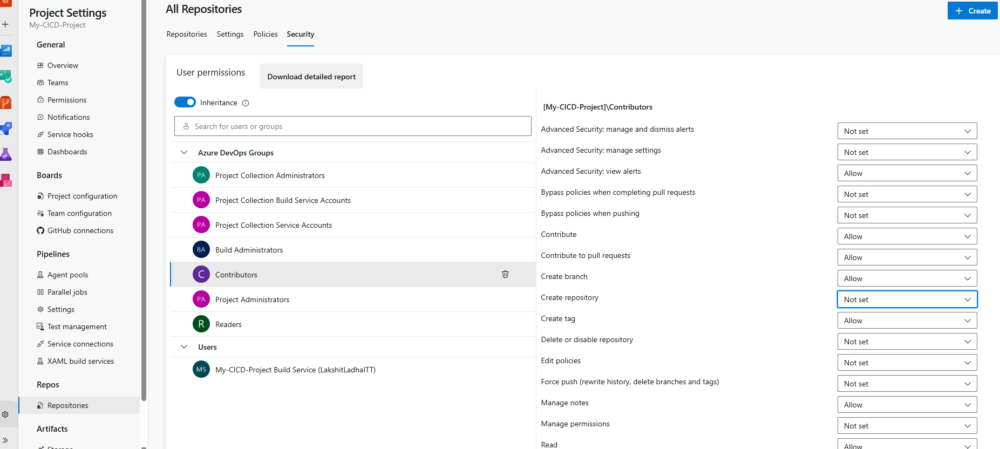

Steps:
1. Add the User to Your Azure DevOps Organization (if not already added), Go to Azure Devops Dashborad and then click one organization settings.
Select organizational settings, under "General" section click on Users. Now, click on add users, and add the user email and give basic Access level.

2. Select the Project, go to repositories. Select the repository.

Now, under permissions, select contributors and add the user to Contributors group (initially).
 

3. Now, to Grant Repository Management Permissions, go to Repository Permissions, select the repository name, choose security and add the required permissions.
