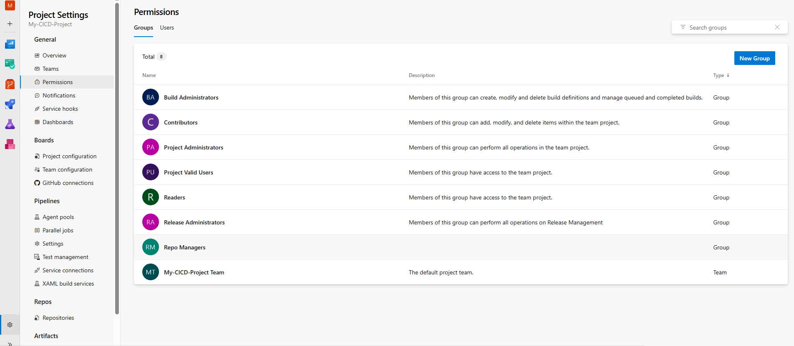
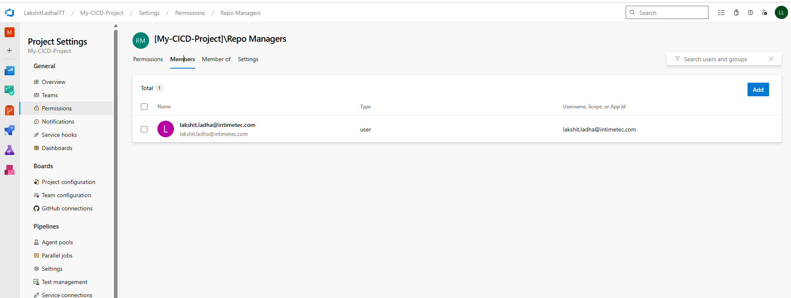
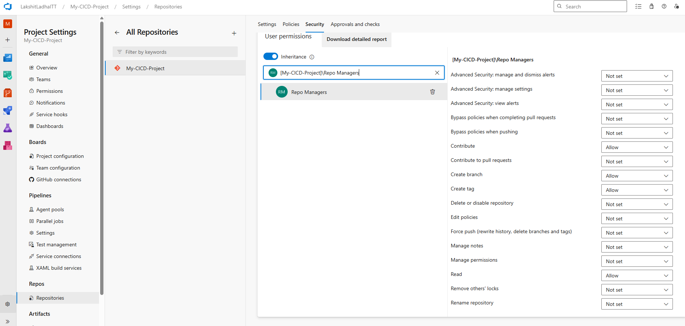

Steps:

1. Go to Project Settings, then under Permissions, click on Groups and choos new groups to add a group. Create the group and add the required users to this group. 
> Created "Repo Managers" group. 
 

> Added user to that group. 
 

2. Under Project Settings, got to Repos, select the Repository. Go to security and search for your group, and assign Repo Permissions to the Group which are only required.
