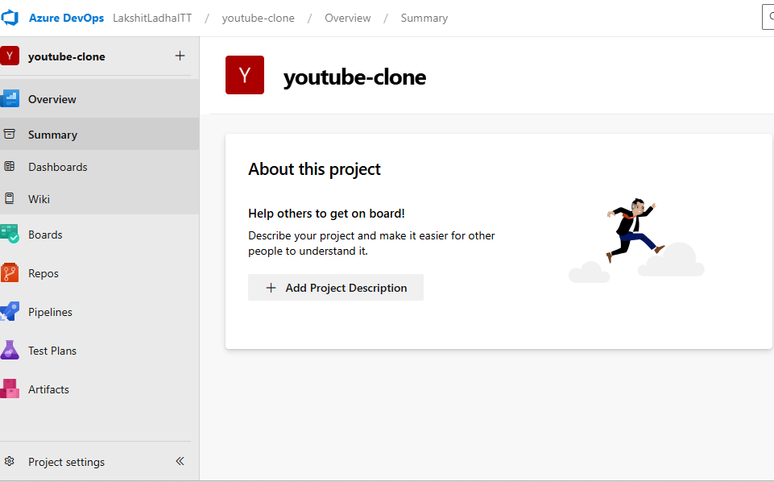
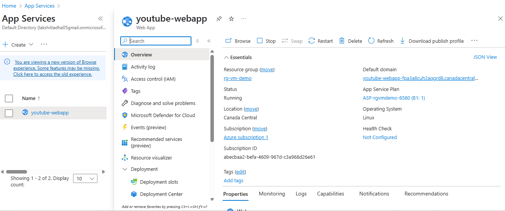
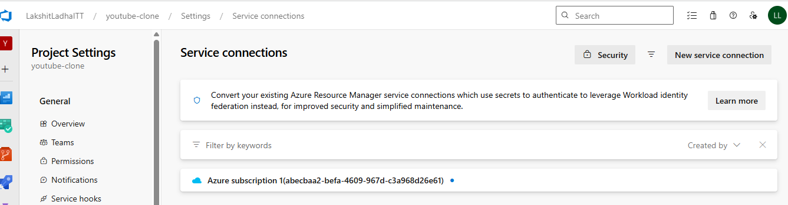
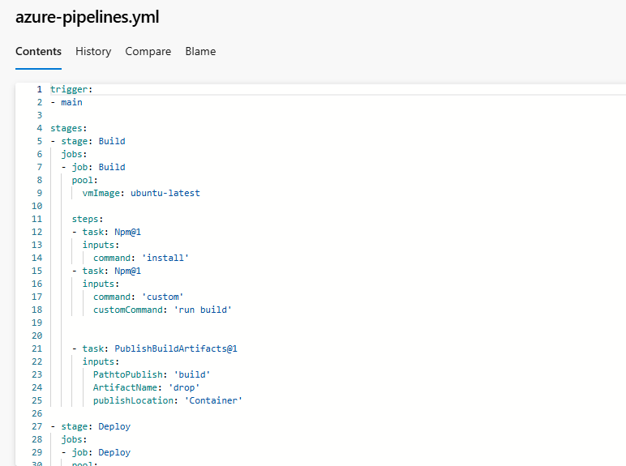
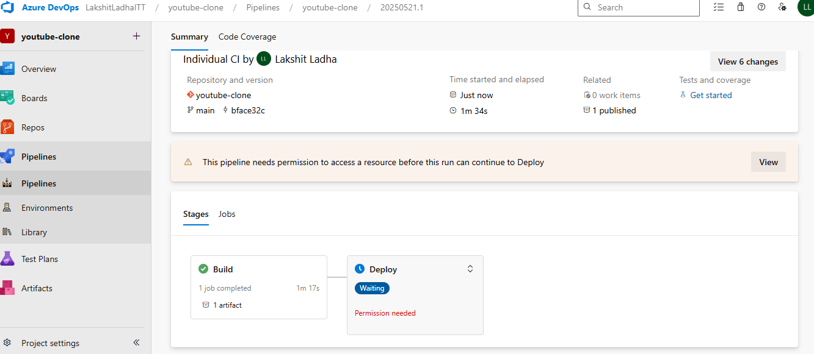
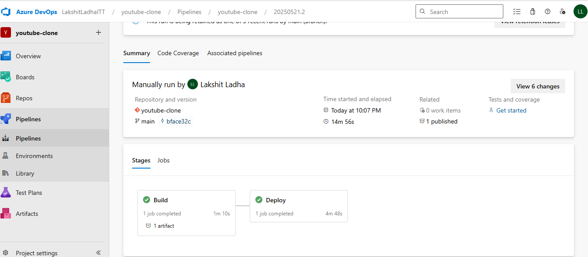
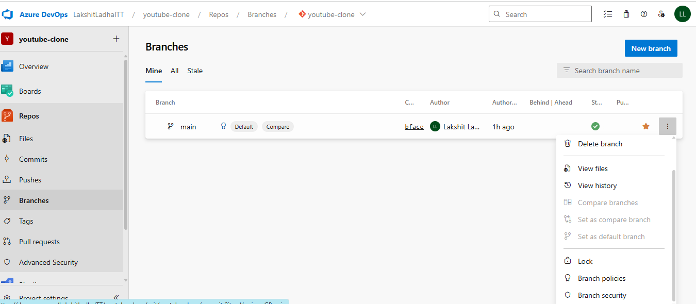
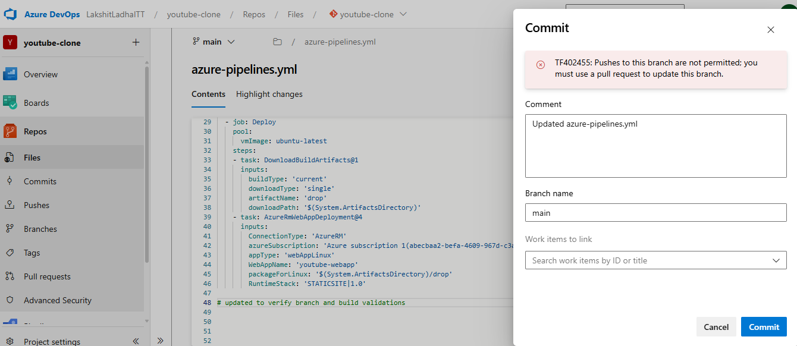

### Part1: Create a YAML-based Azure DevOps pipeline that builds and deploys a sample application to Azure Web App. Add the manual approval on the deployment stage.

Steps:

1. Go to Azure Devops portal, under your organiztion create a Project of "basic" type in your organization.

2. Create a Web App in the Azure Portal, Go to azure portal and search for “App Services” in the search bar and click on “Create”. Fill in the required details such as:
Subscription and Resource Group, App Name, Runtime Stack. 
Click Review + Create, then Create.
 

3. Create a Service Connection, go to azure devops, then select your organization and project. Click on project settings and select Service connection. Create a new service connection.

3. Now, create a '.yml' file in the root directory of your project folder. Now, in the sidebar, click on Pipelines > Pipelines. Click on New Pipeline. Choose your code repository (e.g., Azure Repos Git or GitHub). Select YAML as the configuration method. This allows you to define your build and release process as code.

4. Run and Monitor the Pipeline. 
> Commit your YAML file to the main branch. The pipeline will automatically trigger.  

> After the build stage, Azure DevOps will wait for manual approval.Once approved, the application will be deployed to the Azure Web App. 
 

> Go to azure portal, and open the WebApp service we created, and then click on browse, you can verify whether the youtube is running or not. 

### Part2: Implement Branch & Build Policies to ensure PR validation before merging.

1. Now, got to under "Repos", got to "branches", and then select the "main" branch and then on right hand side 3 dots will appear, select them and add branch poilicies, for example adding more than 1 reviewers before merging to main.
 

2. Now, when we update the "repo" and try to "push" it will not allow to push to main branch.
