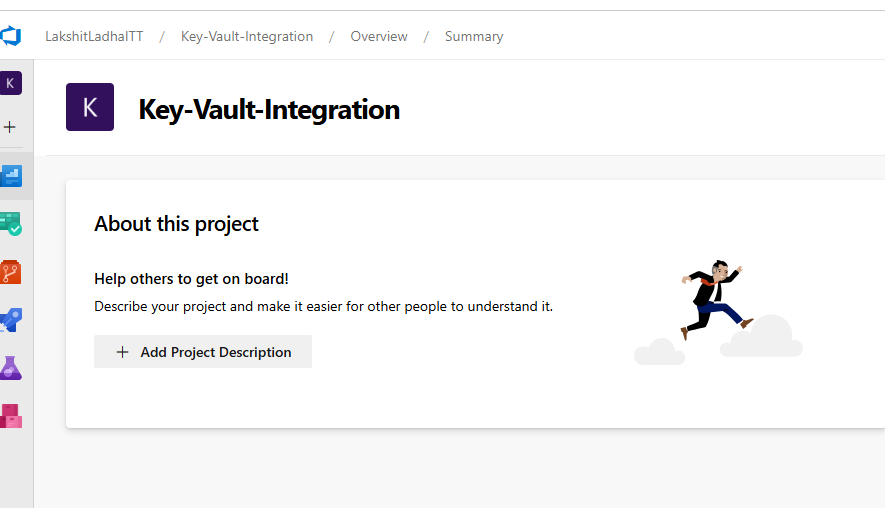
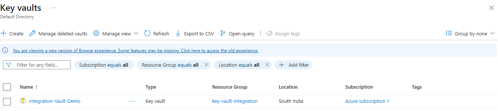
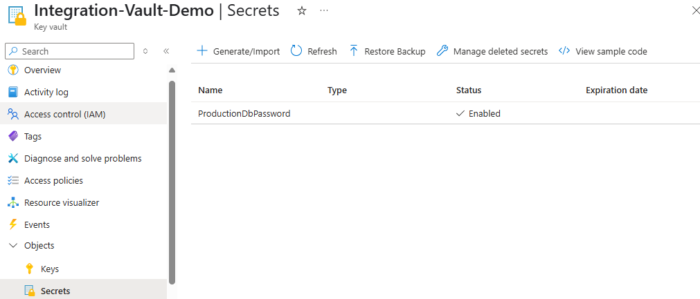
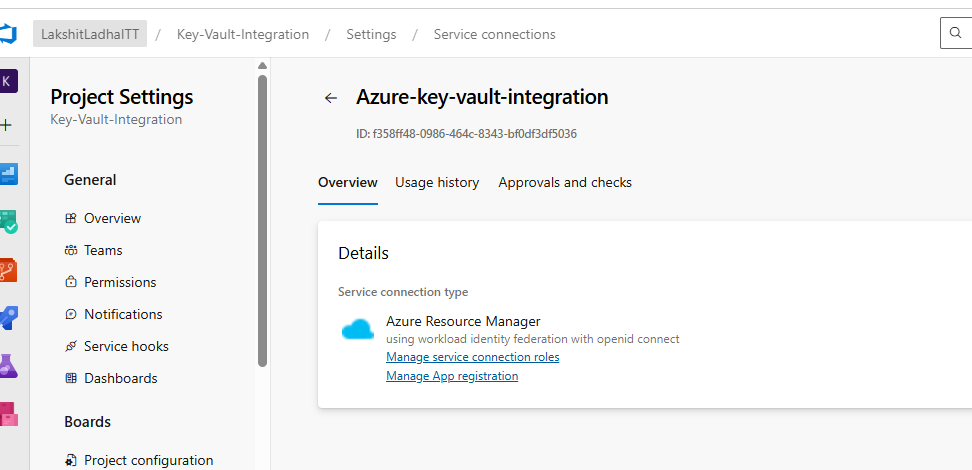
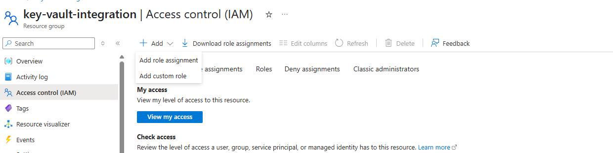

### Part3: Configure Secrets Management using Azure Key Vault.

1. Got ot azure portal,, and under your organiztion create a porject where you want to you Key Vault secrets.

2. Create and Configure Azure Key Vault, go to Azure Portal, search for "Key Vault" and click "+ Create", add the required information such as Resource Group, Key Vault Name and
Region. Finally, Click "Review + Create", then "Create".
 

3. Add Secrets in your key-vault. Open your Key Vault, then go to Secrets, then "Generate/Import", add your secrets here, give it a name and set the value.

4. Create Azure Service Connection, Go to Azure DevOps > Project Settings > Service Connections, click "New service connection", choose Azure Resource Manager,
Select your subscription and the resource group where Key Vault is.

5. Give Azure DevOps Access, go to your Key Vault under Access policies, select "Add Access Policy", then configure access "Secret Permissions: Get" and "Principal: Select your Azure DevOps Service Principal". Finally, click Add and Save.

6. Add Azure Key Vault Task in Your YAML Pipeline, and verify whether secrets are been suceessfully accessed or not.

### Part4: Enable Code Coverage & Security Testing (SAST/DAST).

##### Code Coverage
Code coverage is a metric that shows how much of your source code is tested by automated tests. In Azure DevOps, it's a key part of quality checks during your CI pipeline to ensure your code is well-tested and reliable.
It measures:
1. Line coverage: What % of lines were executed during tests.

2. Branch coverage: Whether each possible path (if/else, switch) was tested.

3. Function/method coverage: Which functions were called by tests.

It basically writes unit tests, then Run tests using a test runner. Collects the  coverage data using a coverage tool. And finally, publishes coverage results to the Azure DevOps pipeline.

##### SAST (Static Application Security Testing)

SAST analyzes your source code, bytecode, or binaries without executing the program. It checks for security issues during the early stages of development.
It is integrated into the CI/CD pipeline (usually during the build stage), and scans the codebase before deployment.

Tools for SAST in Azure DevOps:
1. SonarQube
2. Fortify Static Code Analyzer, etc.

##### DAST (Dynamic Application Security Testing)

DAST tests your application while it's running. It simulates external attacks on your app to find vulnerabilities like an attacker would.
Typically run in the release or post-deployment stage. It needs a live, running application to test.

Tools you can use in Azure DevOps:
1. OWASP ZAP
2. Burp Suite

