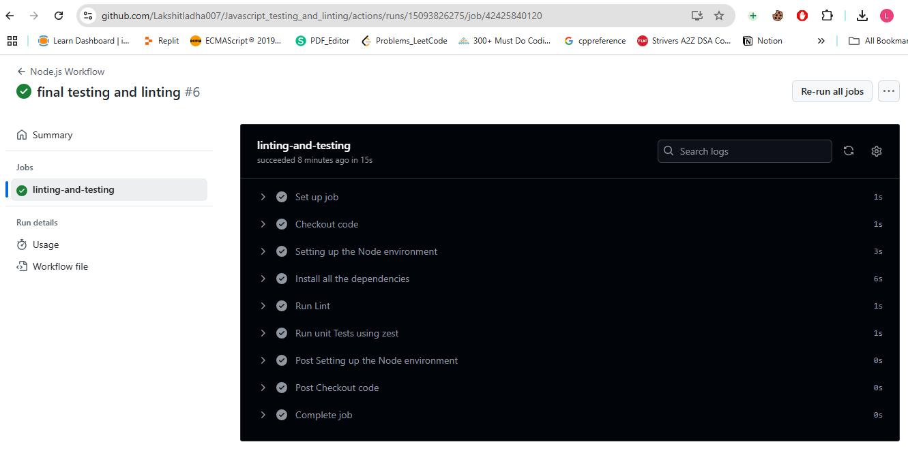

Steps:

1. Add all the files in the directory structure as followed in the folder.

2. Now, push the changes to github repository and verify whether testing and linting run successfully or not on the github UI.
