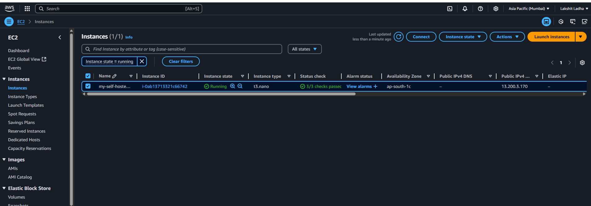
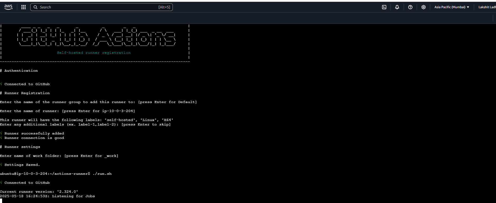
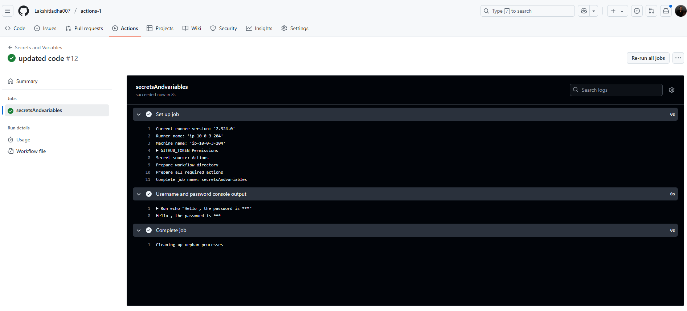

Steps:

1. To create a self hosted runner, create  an ec2 instance in AWS and choose OS as linux, allow "http" and "https" traffic and also enable "assign public ip"

2. Open your github repository, go to settings, under "Actions", choose "runners", now create a new self-hosted runner, choose "linux" OS. And run the given steps on your ec2 machine.

3. Now, Go to repository settings, choose secret and variables, and add secret & variable.

4. Now, add the code for yml file, and push the changes. 

5. Verify whether the pipeline has been successfully executed or not.

6. Also, verify on EC2 machine, about the workflow.

