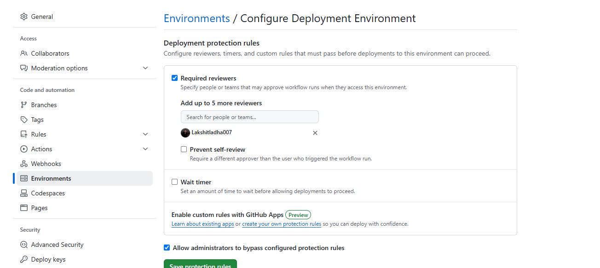
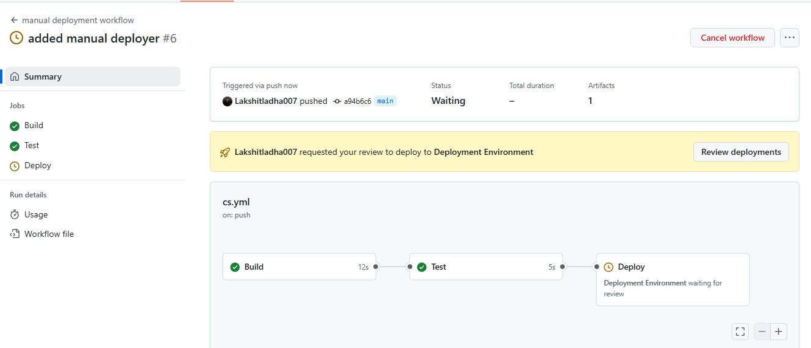
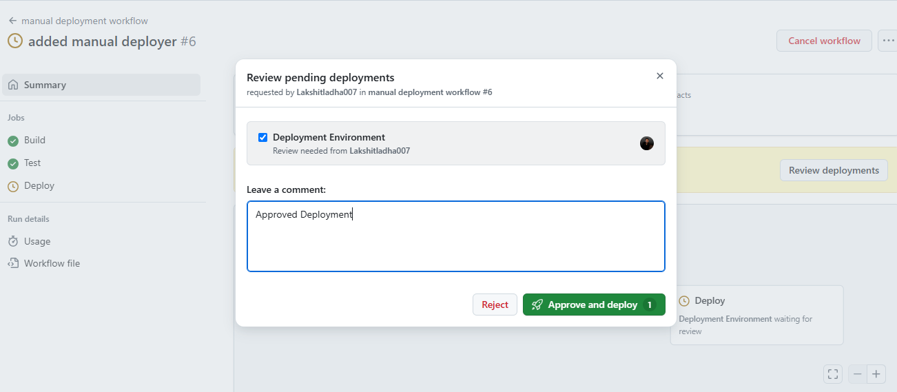
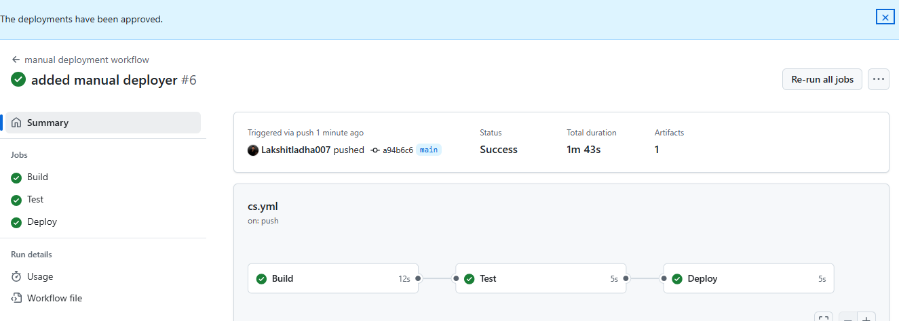

Steps:

1. Go to your repo settings, and under Environments, create a new environment and add a reviewer before deployment.

2. Now write your cs.yml file and in deploy job, add the Environment, so that it asks for manual approval before deployment.

3. Now, push the code to github and verify the process.
> Approval needed before deployment: 
 

> Added approval: 
 

> Workflow successfully executed:
