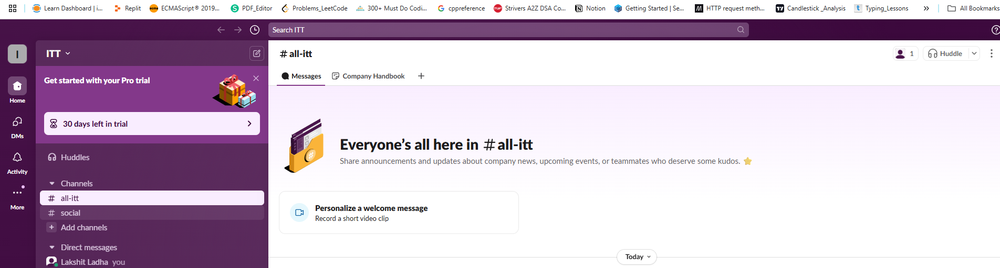
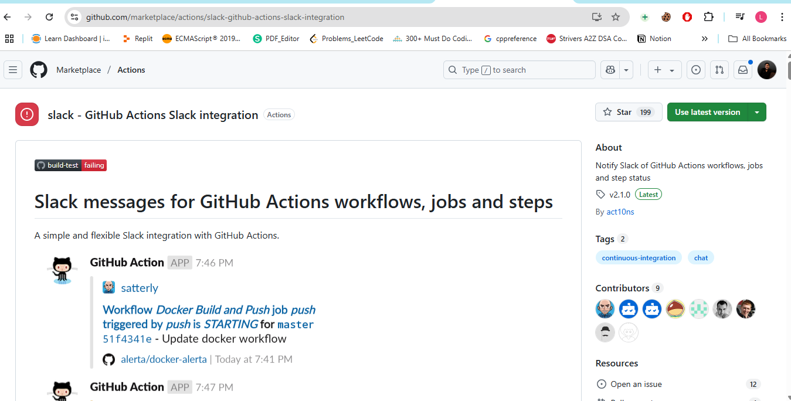
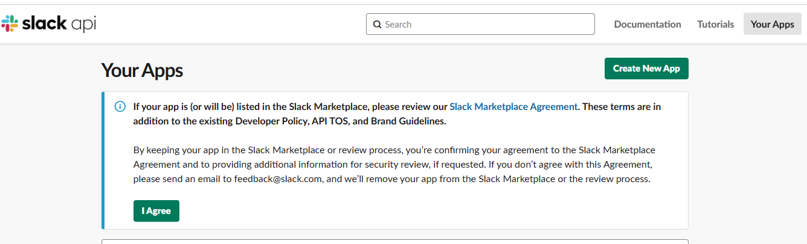
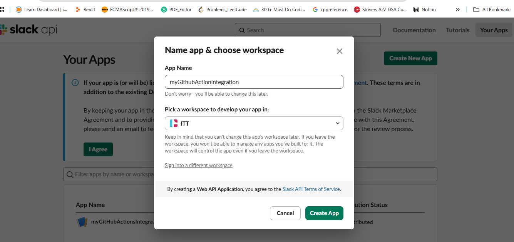
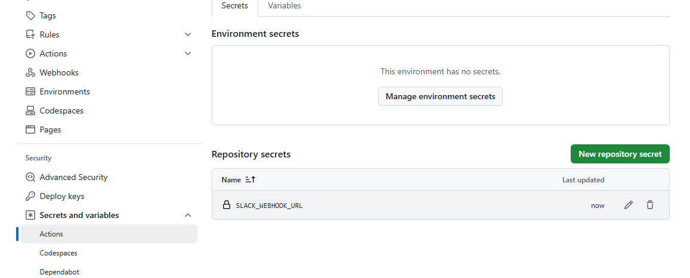
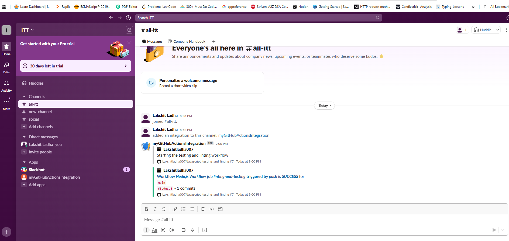
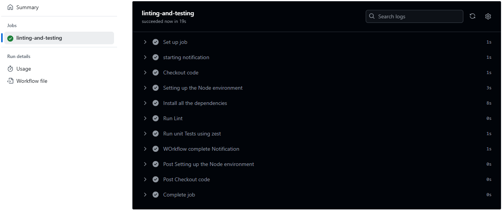

Steps:

1. To integrate slack with Github Actions, it is necessary to have Slack workspace configured and channel is created, and also make sure your project is configured in github. If not create an account on slack.
 

2. We are going to use "slack-Github Actions Slack Integration" action. 

3. Go to this URL "https://api.slack.com/apps" and click create a new app, then select create from scratch. Now, choose app name and workspace. 
  

> After creating app, under "features", choose "Incoming Webhooks", then activate it. Then, add a new webhook and select the channel. 

> Copy the webhook URL, go to Github repo, then go to settings, under security choose "secrets and variables", then select Actions and add the webhook URL. 
 

> Now, just configure the workflow to receive notification on slack, whenever the workflow is triggered, notification are received on slack configured channel. 
 

> Job build success 
