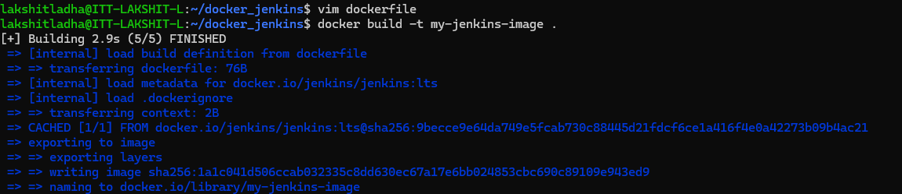
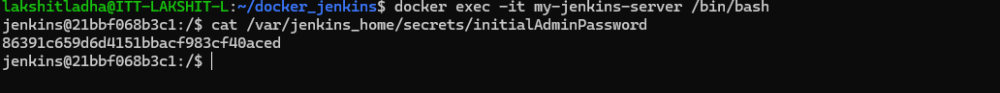
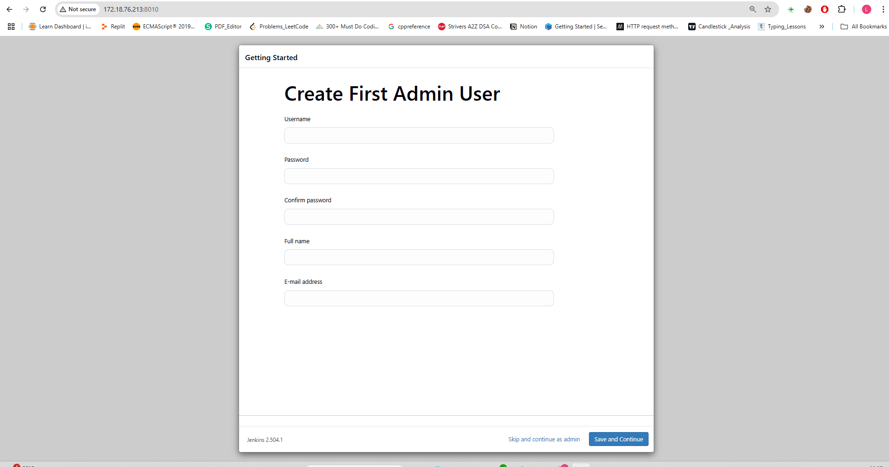

Steps:

1. create a dockerfile and mention the specifications.

2. Now, build the image using the command:
```bash
docker built -t my-jenkins-image .
```


3. Now, run the container using the command:
```bash 
docker run -d --name my-jenkins-server -p 8010:8080 my-jenkins-image
```

4. Now, go the browser and add "http://<ip_of_machine>:8010" to view jenkins server is up and running.

5. Now, exec into the conatiner and view the password required to get jenkins access.
```bash
docker exec -t my-jenkins-server /bin/bash
```
Once you are inside the conatiner, to get the password run:
```bash 
cat /var/jenkins_home/secrets/initialAdminPassword
```


6. Add this password to jenkins page and create you user to access jenkins.
