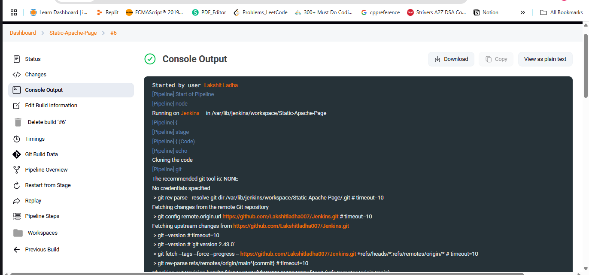
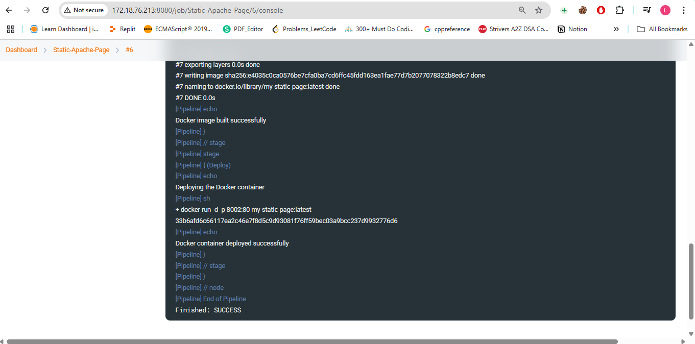
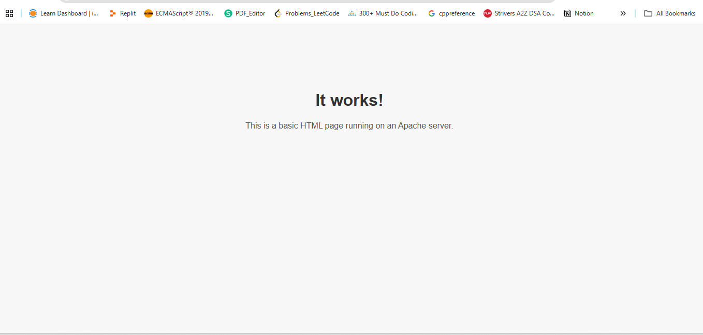

Steps:

1. Create a file that contains html code to host static website on web browser.

2. Now write a docker file that contains apache image, and uses html code to hosted on web browser.

3. Push the dockerfile and index.html to a repository on Github.

4. Create a new job and choose type as "pipeline" and choose SCM as git and add the git URL of your project. Add the yml code for the pipeline, and finally, apply and save.

5. Also add the jenkins user into the docker group on the machine you are running jenkins(It can be an EC2 instance or your local machine).

6. Now, build the job to run the server.
 
 

7. Now go to the browser and search for ""http://<ip_of_machine>:8002, you will see on the browser that the apache server is up and running.
