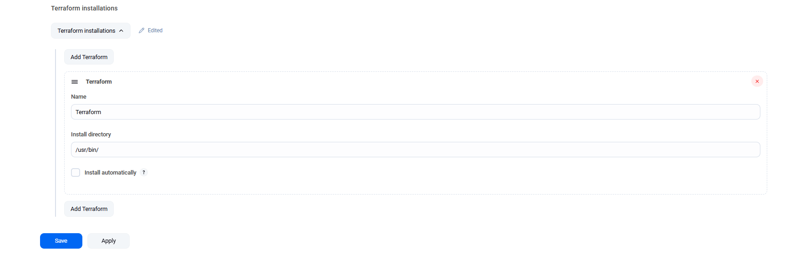
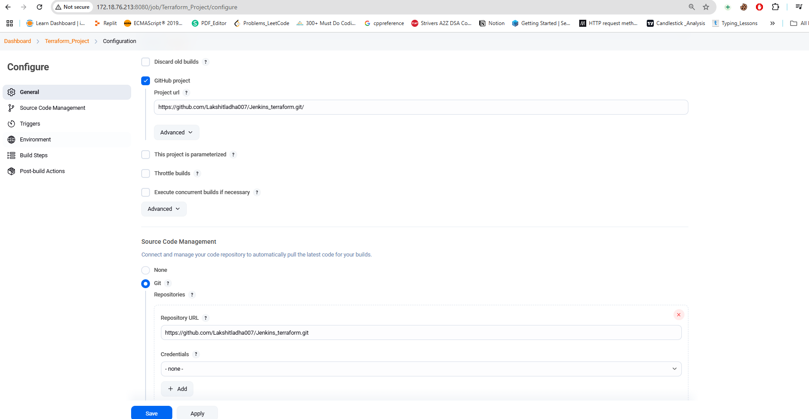
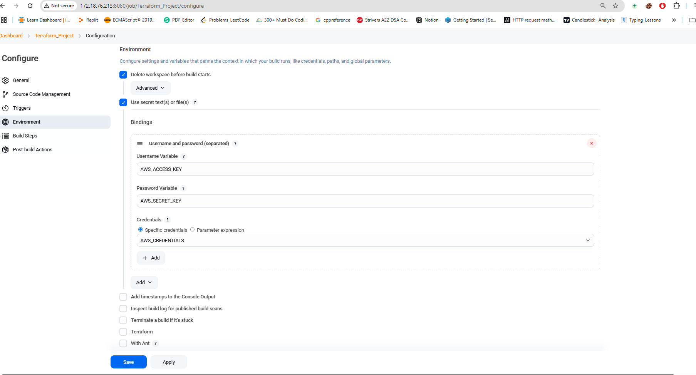
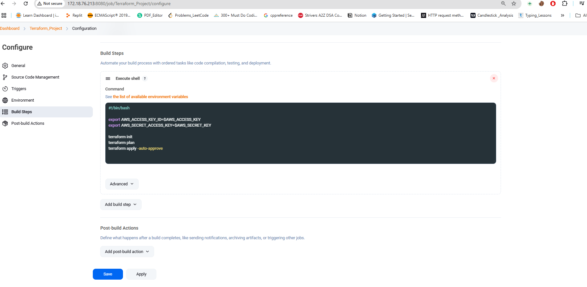
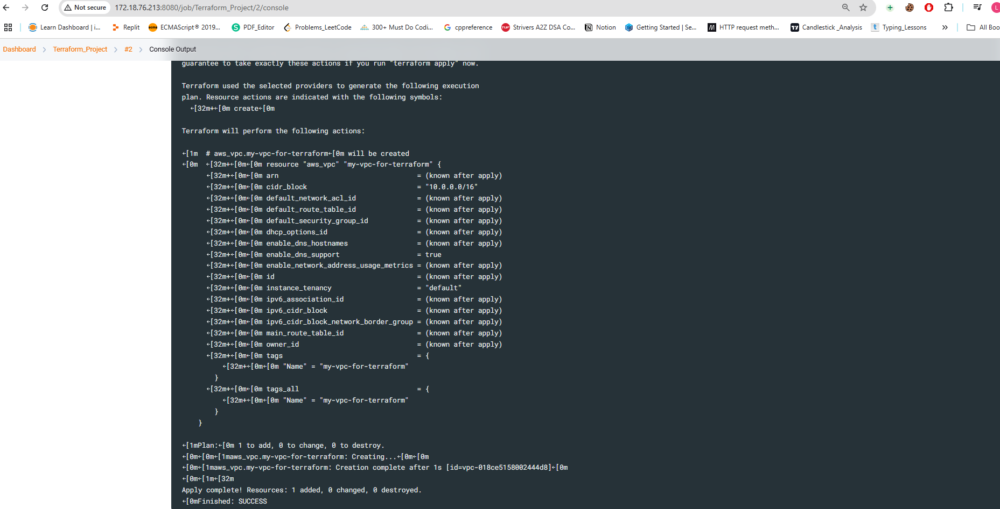
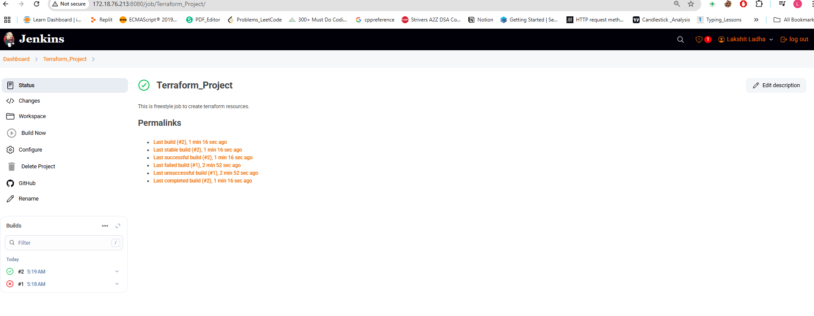
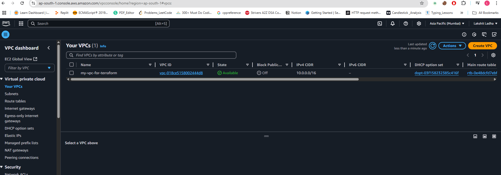

Steps:

1. Create a main.tf file that contains information regarding the infrastructure to be created, and push that file to a github repository.

2. Now, install terraform on the machine where jenkins is running. 

3. Go to jenkins Dashboard, then Manage jenkins and select Tools configuration, add path of local machine where terraform is present. Click on apply and save.

4. Go to jenkins Dashboard and click on create an new item(job), choose freestyle project. Now:
> Choose Github project and under SCM choose git, and add github project URL in both. 
 
> In environment, choose "Delete Workspace before build starts", and also select "use secrets text or file", again select "username and password(separated)", now name the username variable as well as password variable and select the "specific credentials". 
 
> Under build steps, choose "Execute shell" and add the script. And, finally apply and save. 

5. Now, build the job and see whether it is successfully build or not.
 

6. Once, job is successfully build go to AWS console and verfiy whether the resources have been created or not.
