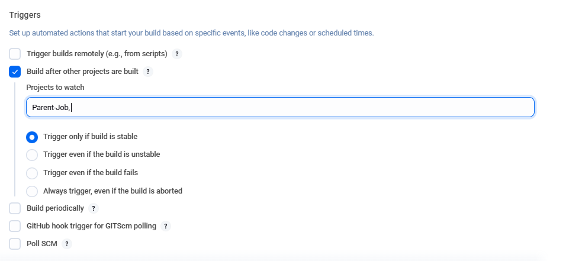
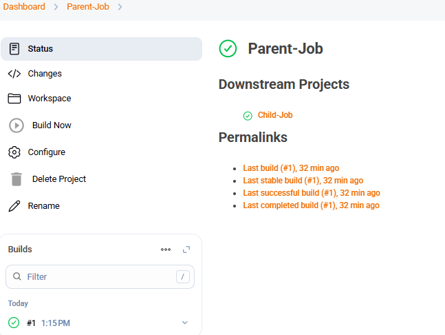
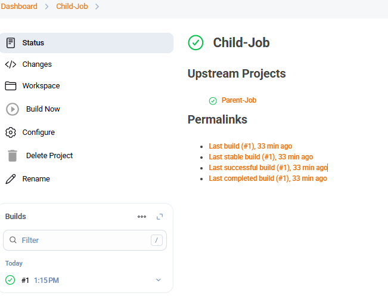

Steps:
1. Open the Jenkins Dashboard and open the child job.
Click on your Parent Job, and click on configure from left-side menu.

2. Now, under triggers, choose "Build after other projects are build" and choose the "parent-job", and select "Trigger only if build is stable".
 

3. Now, finally Click “Save”.

4. Now, go to jenkins dashboard and run the 'parent-job', once the build of parent-job is successfull, the child-job will be triggered.
 

