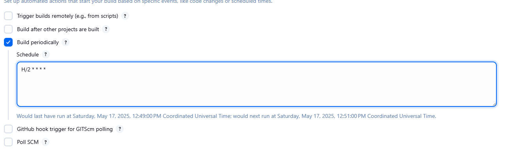
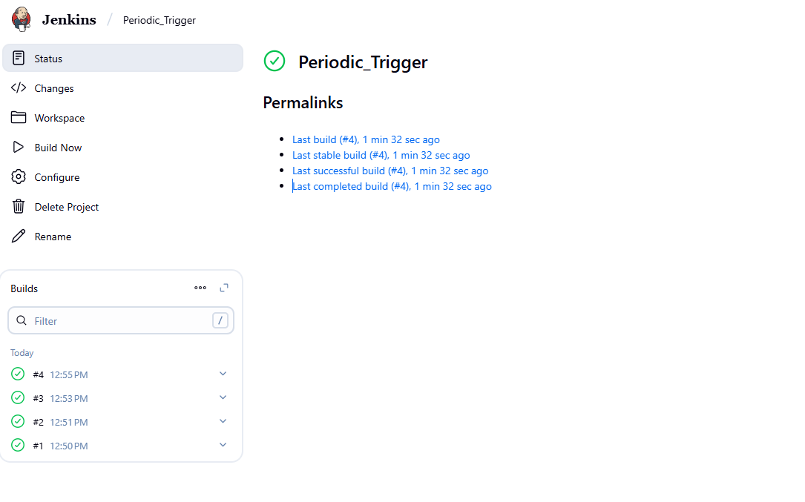

Steps:

1. Go to your Jenkins Ui, click on add item and create a job.

2. Now, select the job and Click on "Configure" in the left sidebar.

3. Scroll down to the "Build Triggers" section and select "Build periodically" and add value:  
To run every 2 minutes:  
*H/2 * * * *
 

4. Finally, "Save" button to apply the changes.

5. Now, verify whether the job is running or not according to the schedule.
