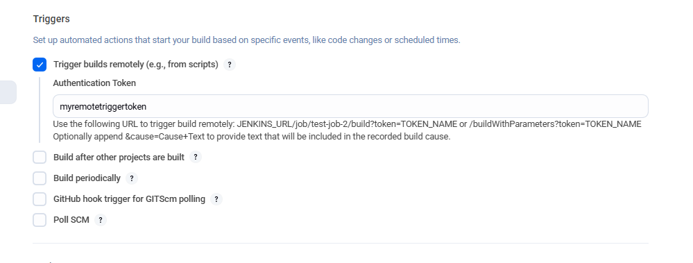
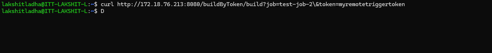
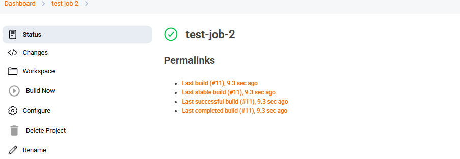

Steps:

1. Go to your Jenkins Ui, click on add item and create a job.

2. Now, select the job and Click on "Configure" in the left sidebar.

3. Scroll down to the "Build Triggers" section and select "Trigers Build Remotely" and add Authentication token as "myremotetriggertoken"
  
4. Finally, "Save" button to apply the changes.

4. Now, install a plugin,"Build authorization root token" and now use: 
Lets say you want to trigger the RevolutionTest job with the token TacoTuesday:

"http://<public_ip_of_ec2>:8080/buildByToken/build?job=RevolutionTest&token=TacoTuesday"

5. To run trigger job from terminal we need to modify the URL by adding '\' before '&', now we can use this: 
"http://172.18.76.213:8080/buildByToken/build?job=test-job-2\&token=myremotetriggertoken"

5. Now, verify whether the job was triggered or not by visting the jenkins UI.
