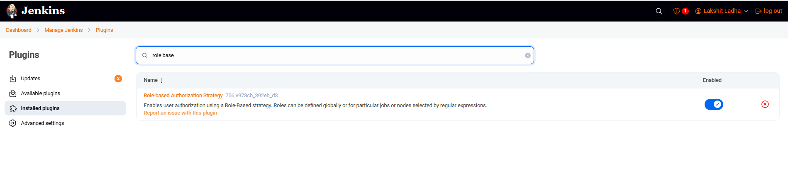
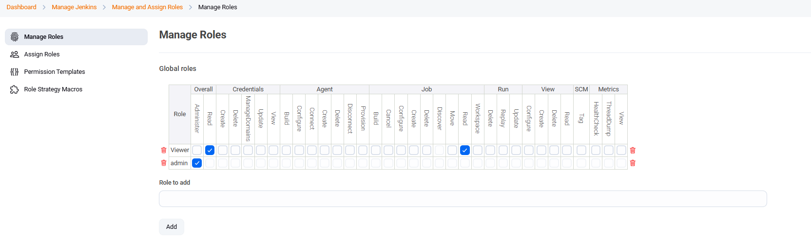
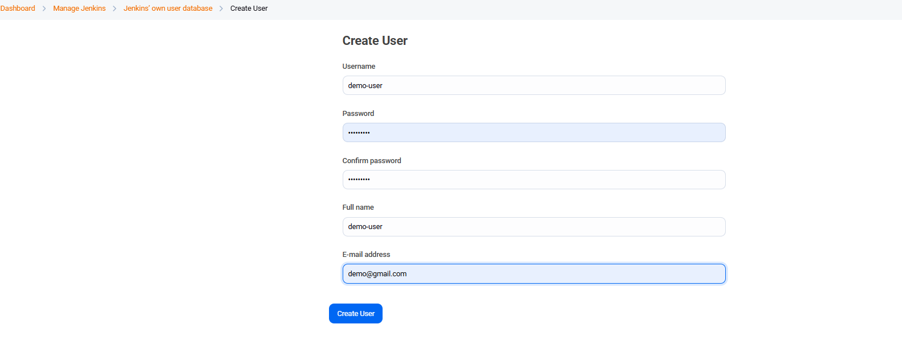
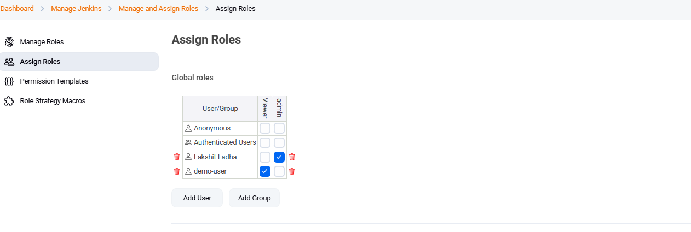
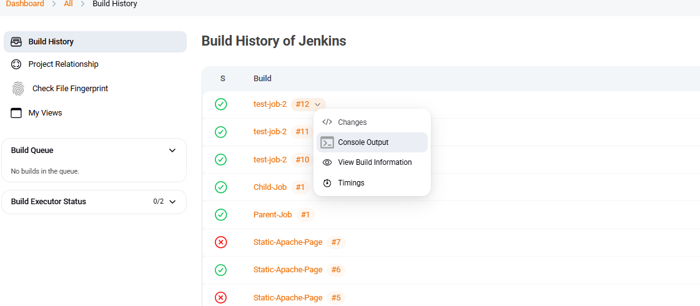
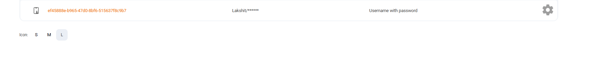
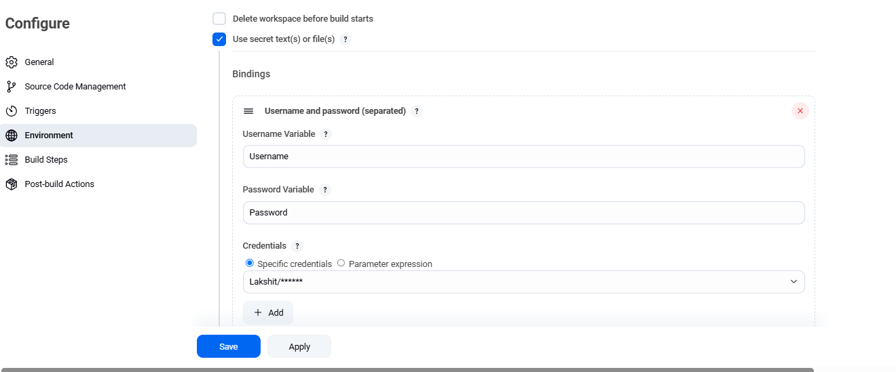
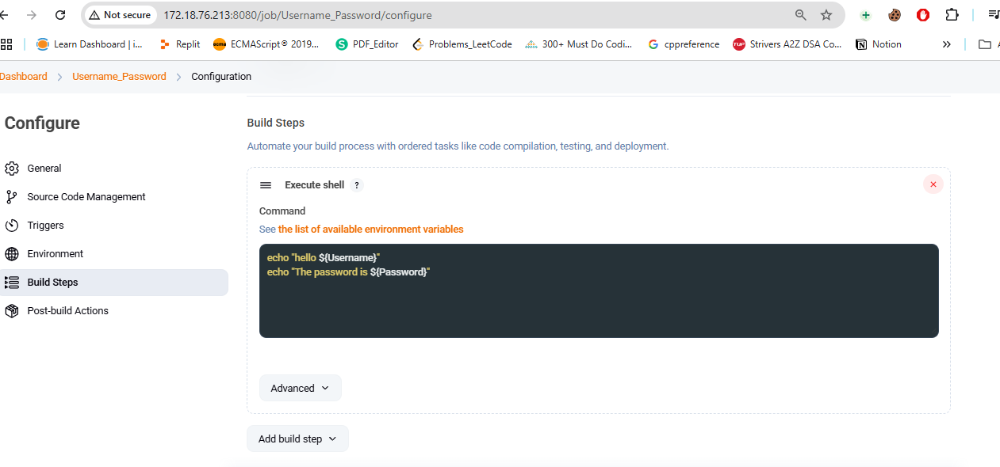
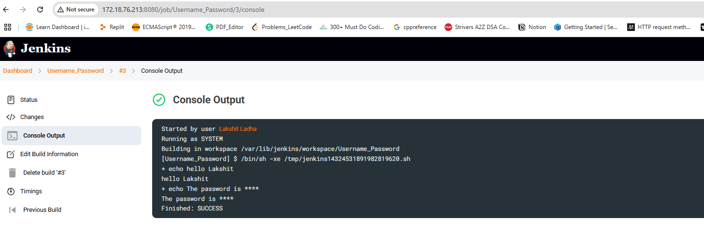

### Implement RBAC to restrict access
Steps:

1. Install Role-Based Authorization Strategy Plugin, then Go to 'Manage Jenkins', then 'Manage Plugins', search for 'Role-based Authorization Strategy', Check the box and click Install with restart.

2. Now, Role-Based Authorization in Jenkins. Go to Manage Jenkins, then click on Configure Global Security and under Authorization, select "Role-Based Strategy", and click on "save".

3. Again, go to Manage Jenkins, choose Manage and Assign Roles, then select Manage Roles and create a role, and give the required permissions.
 

4. Now, Create a user by going to manage jenkins, then under security choose Users. Now, click on create user.
 

5. Now, assign the role to users. Go to Manage Jenkins, the under Manage and Assign Roles, select Assign Roles, and assign the role to user.
 

6. Now, login with the created user, and you will see the user does not have the permission to "build" job as it was not attached with the created user.

### Store credentials securely

Steps:

1. Go to Jenkins Dashbaord, then Manage Jenkins, go to Credentials, then system and under Global Credentials, add credential of type "username and password", click on save.

2. Now, go to items and create a job, in configure under Environment variables choose "use secret text(s) or file(s), name the Username and password variable and select the Credentials. 

3. Under build steps, choose execute shell and add the script to access secret variable. Then, finally click on "apply" and "save". 

4. On go to dashboard, and build the job. Go to console output to view the value of secrets.
