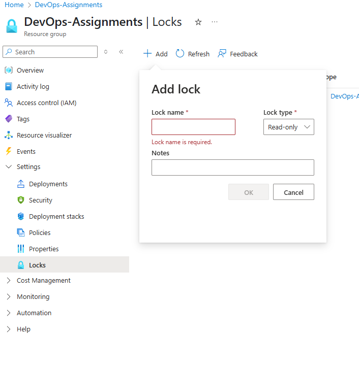
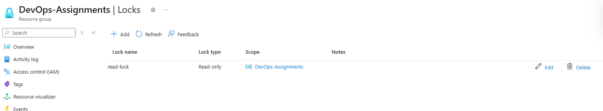
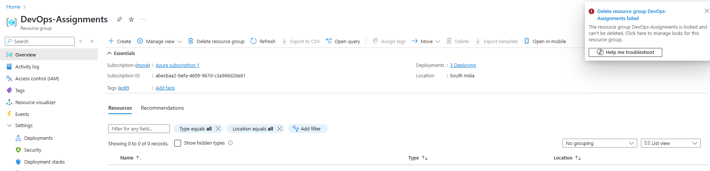

Steps:

1. Sign in with your Azure account, create a Resource Group. 
In the search bar at the top, type “Resource groups” and click on it. Click “+ Create” or “+ Add” at the top. Now, fill the required details, such as Subscription, Resource group name, Region and Click “Review + create”, then click “Create”.

 

2. Apply a Lock to the Resource Group. 
Go back to Resource groups, click on the name of your new group, then click “Locks”. Click “+ Add” at the top, fill details like Lock name, Lock type. Click OK to apply the lock.
