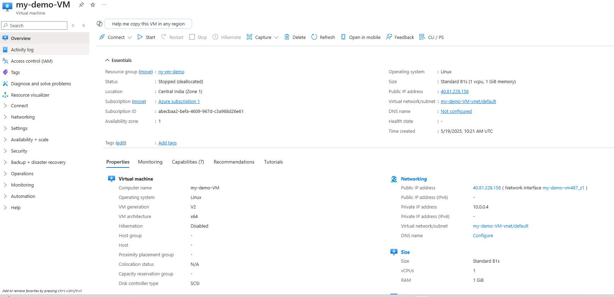
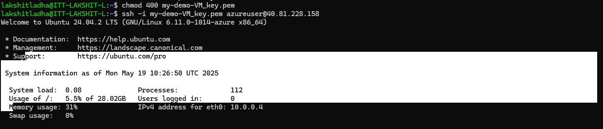
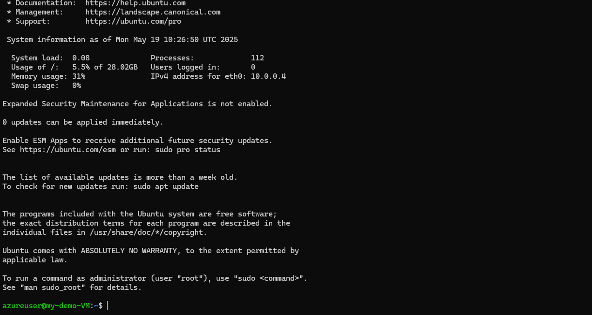

Steps:

1. Log in to Azure Portal, search for Virtual Machines, under "infrastructure" select Virtual Machines, click on "+ create", then choose "Azure virtual machine".

2. Basic configuration setup, select Subscription, Resource Group,Virtual Machine Name, Region, Image(Pick your OS), Authentication Type(For Linux: SSH public key or password
and For Windows: Password only). Inbound ports – Check: SSH (port 22) for Linux and
RDP (port 3389) for Windows.

3. Click, remaining options as default for general user. Finally, Review and Create.
Review all settings. Click "Create". Azure will validate and start deploying your VM.

 

4. Connect to Your VM: 
> For Linux: Use SSH (ssh username@public-ip). 
> For Windows: Download the RDP file and log in with your credentials. 
 

