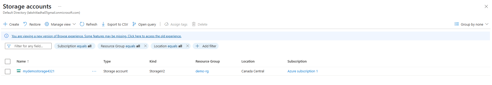
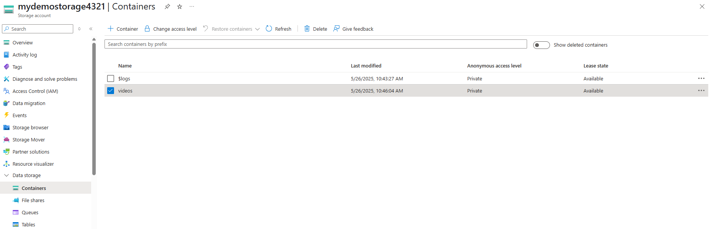
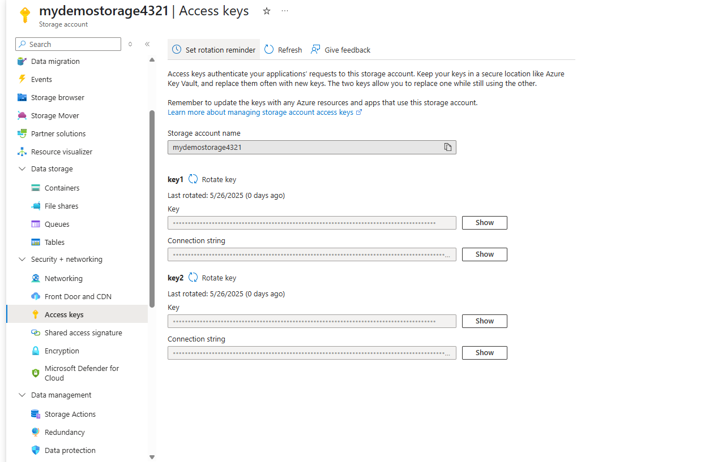
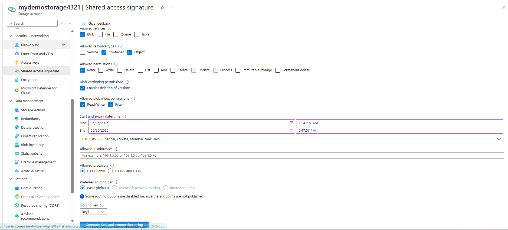
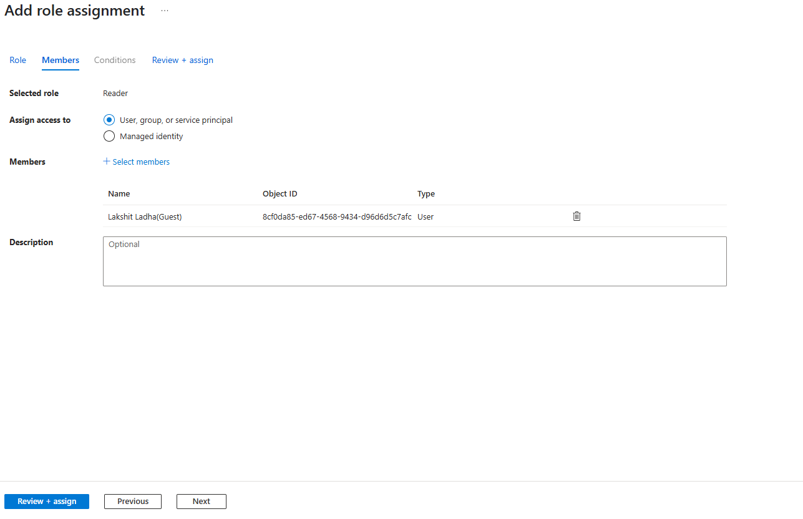

Steps:

1. Create Azure Storage account. 
> Go to azure portal and search for Storage account service, then click on "+ create", then enter the details like subscription, resource group, name, region, etc. Click on "review + create". Finally, click on "create"
 
> Now, go to storage taht we created, and under "Data Storage" choose "Containers", click on "+ create", add container name and now you can store data in this container.

2. Access keys

> Select the storage account that we created, and click on "security and networking", then choose "access keys" on left side bar menu.
Azure provides two access keys for each storage account. Now, these access keys can be used to access the complete storage account.

3. Shared Access Signature(SAS)

> Select the storage account that we created, and click on "security and networking", then choose Shared Access Signature(SAS) on left side bar menu. Now, choose which are allower dervices, allowed resource types, and allowed permissions. We can also add start and expiry time. Choose 
the "signing key" and click on "Generate SAS and connection string". It will give SAS token and connection string.
You can copy this URL and share it or use it to access the blob or container.
 

4.Role Based Access Control(RBAC)

> Select the storage account that we created, and click on Access policy(IAM), now click on "+ add", then choose "add role assignment" and select the desired role, now assign this role to a user or managed identity.

  
  
### Different types of storage in Azure Storage Account:
1. Blob Storage
> Used to store unstructured data like images, videos, documents, backups, etc. 
> Supports different blob types: Block blobs, Append blobs, Page blobs. 
> Provides high durability, scalability, and access via HTTP/HTTPS or REST APIs. 
> Commonly used for serving media files, storing backups, and big data workloads. 
> Integrates well with Azure Data Lake, Azure Functions, and analytics tools. 
> Offers encryption at rest and in transit, and supports role-based access control (RBAC). 

2. File Storage
> Offers cloud-based file shares accessible via the SMB protocol. 
> Ideal for applications needing a shared file system, usable from both cloud and on-premises. 
> Supports multiple clients accessing the same share simultaneously. 
> Suitable for migrating on-premises file servers, user data storage, and application file shares. 
> Provides encryption, high availability, and integration with services like Azure VMs. 

3. Queue Storage
> Designed for message storage and communication between distributed applications or microservices. 
> Supports storing millions of messages and retrieving them reliably. 
> Enables asynchronous processing, task scheduling, and workload distribution. 
> Useful for decoupling services, handling bursts of workloads, and ensuring message durability. 
> Accessed through REST APIs or client libraries, with encryption and RBAC. 

4. Table Storage
> A NoSQL key-value store for storing large volumes of structured or semi-structured data. 
> Allows schemaless design, making it flexible and scalable. 
> Delivers fast, predictable performance for queries using partition and row keys. 
> Often used for storing logs, user profiles, metadata, session data, etc. 
> Accessed via APIs or SDKs and integrates with services like Azure Functions. 
> Cost-effective for large-scale data storage with simple query requirements. 

5. Disk Storage
>  Provides durable, high-performance block storage for Azure Virtual Machines (VMs). 
> Includes OS disks, data disks, and temporary storage options. 
> Delivers low-latency, high-throughput performance suitable for databases and enterprise workloads. 
> Supports scaling, disk backups, snapshots, and flexible management. 
> Can be easily attached or detached from VMs. 
> Used for databases (SQL, NoSQL), application data, and persistent VM storage. 

##### Conclusion
Azure offers various storage types tailored to different workloads: 

1. Choose Blob for unstructured large data,
2. File for shared file access,
3. Queue for messaging,
4. Table for structured NoSQL data,
5. Disk for high-performance VM storage.

