### Create an Azure Container Registry (ACR)

Steps:

1. go to your Azure account and create a container registry.
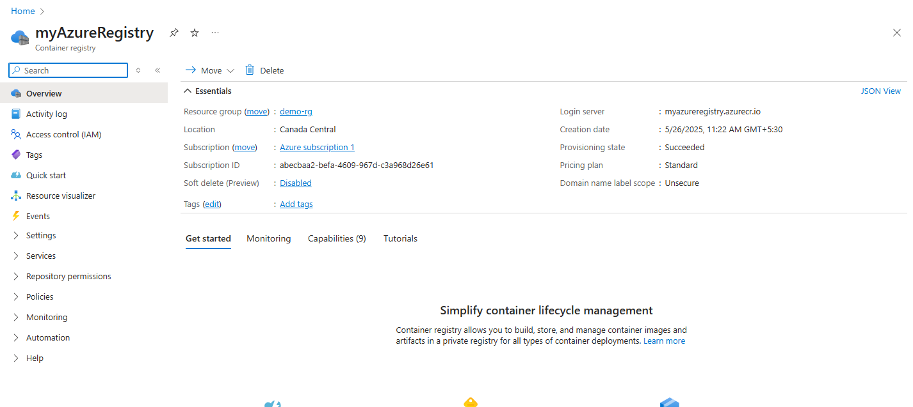 

2. Once the registry is created go to Access Policy(IAM), click on "+add", and assign required permissions to the user.

3. Use the folowing command to connect to your Azure Account:
```bash
az login
```
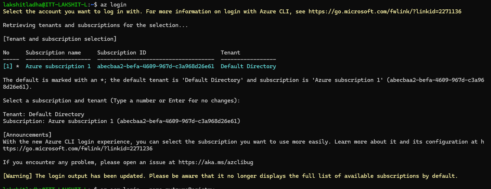 

4. Login to you container registry, using the command:
```bash
docker login myregistry.azurecr.io
```
The above command returns Login Succeeded.
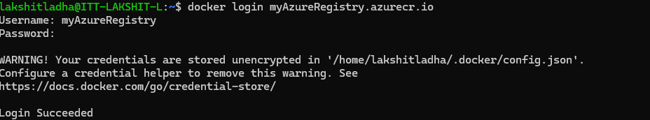 


3. Create an alias of the any image that is present on your local system, tag that image using the follwoing command:
```bash
docker tag nginx myregistry.azurecr.io/samples/nginx
```
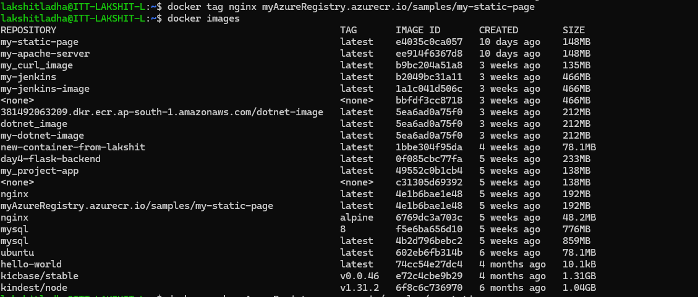

4. Now, push the follwoing image to azure conatiner registry.
```bash
docker push myregistry.azurecr.io/samples/nginx
```
 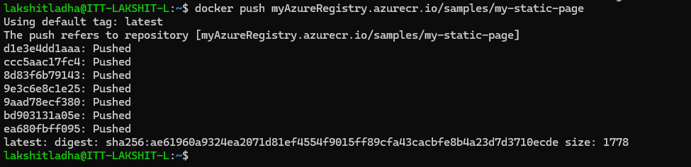 
5. Go to the Azure console and verify whether the image has been successfully pushed or not.
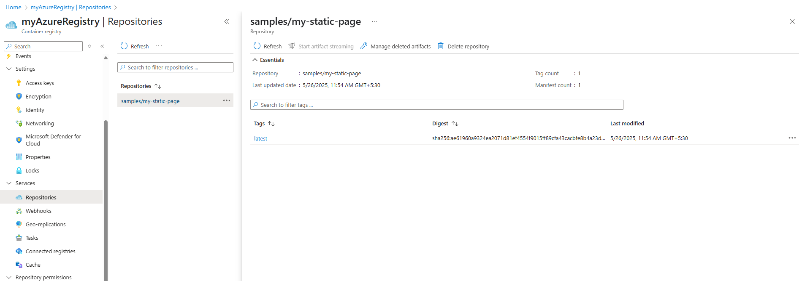 

6. Now, pull the image from Azure and run the conatiner and expose the ports to access on browser.
```bash
docker pull myAzureRegistry.azurecr.io/samples/my-static-page
docker run -it --rm -p 8880:80  myAzureRegistry.azurecr.io/samples/my-static-page
```
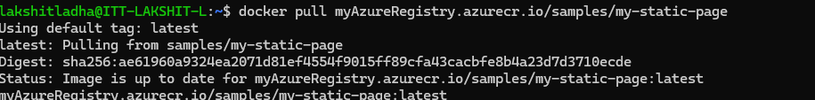 
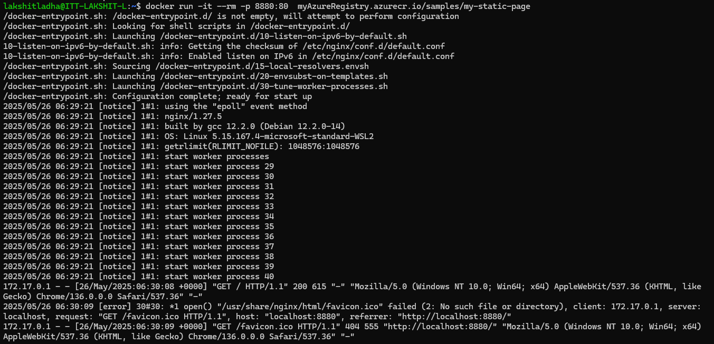 

7. Now, open your browser and verify whether the nginx sever is running or not.
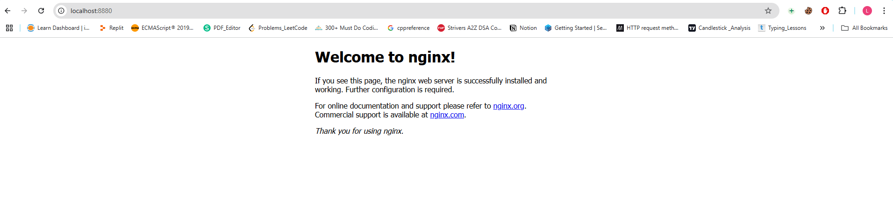

### Custom IAM Role that provides access to manage ACRs in a Resource Group.

Steps:

1. Go to your azure portal and navigate to Subscriptions, in the search bar, type "Subscriptions" and click on it.
Select the subscription where your resource group and ACR exist.
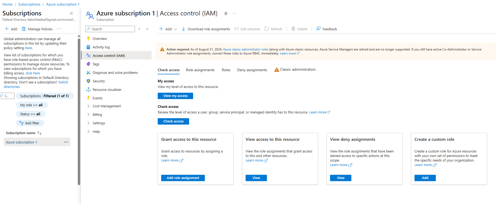 

2. Go to “Access control (IAM)”, click on Access control (IAM), Click the “+ Add” dropdown and then select “Add custom role”.
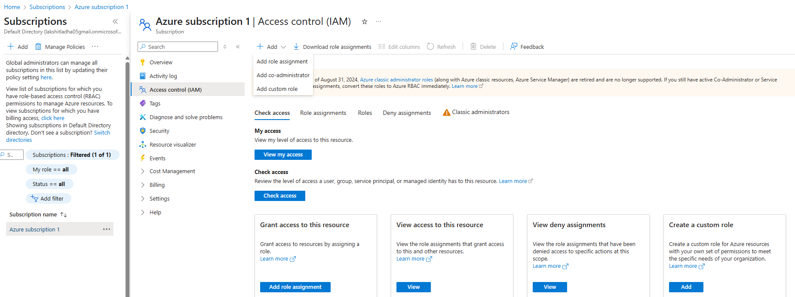 

3. Create a role with suitable name, choose scope as "resource group" and give the minimum permissions as required.
Click Create.
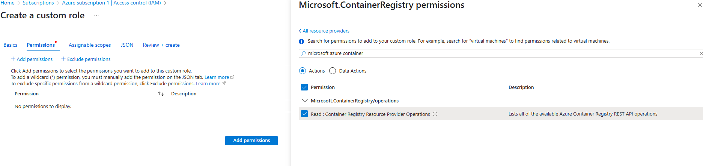 

4. Assign the Custom Role to a User or Service Principal. Navigate to your resource group (the one you selected in the scope).
Go to Access control (IAM). Click “+ Add” > “Add role assignment”. Select the custom role you just created.
Click Next. Choose the user, group, or service principal to assign. Click Review + assign. And, finally we are done with assigning permission to a particular group.
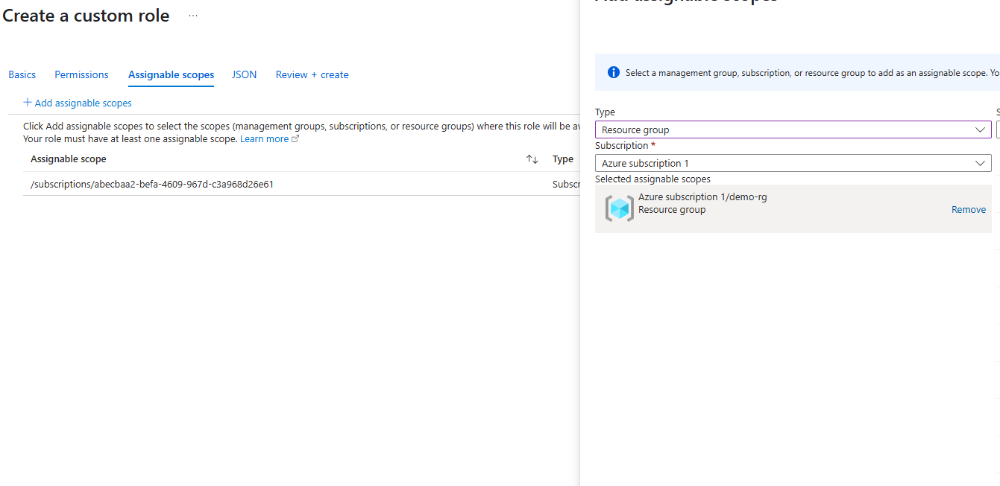