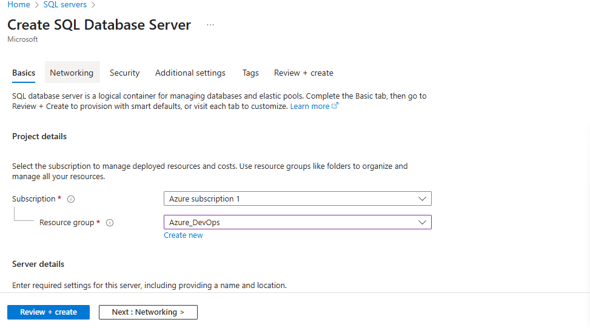
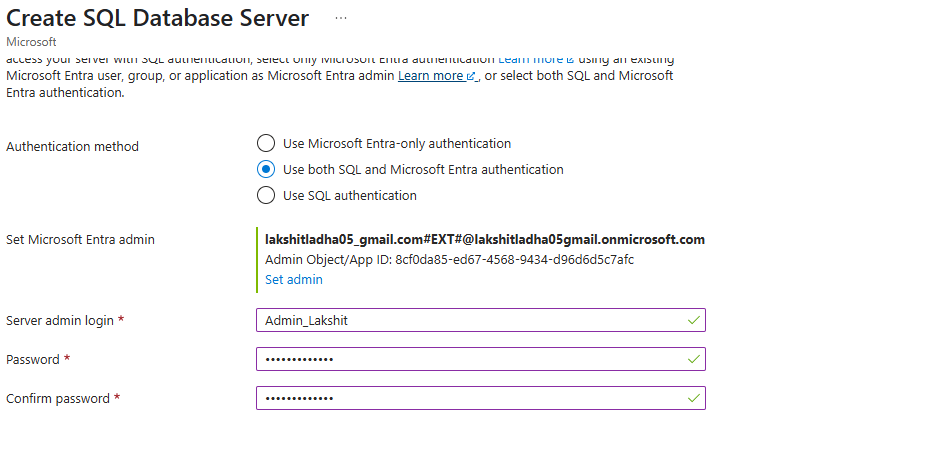
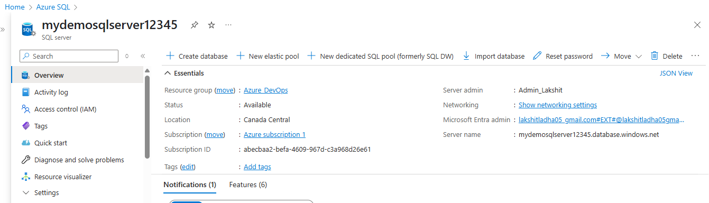
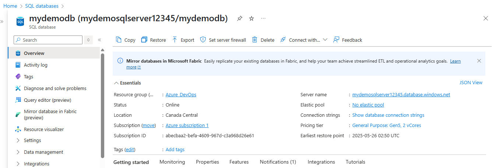

Steps:

1. Create a SQL Server, in the search bar, type “SQL servers” and click it, Click "+ Create". 

> And add the basic required information, such as subscription and Resource Group, server name, authentication(both SQL and Azure AD Authentication)create a SQL admin username and password, also under Azure AD authentication, click Set admin. 
  

> Click Review + Create, then Create. 
 

2. Create a SQL Database. In the Azure portal, search for “SQL databases”, Click "+ Create", add basic information such as Database name, select the SQL Server that we created in step1 and click Review + Create, then Create.
