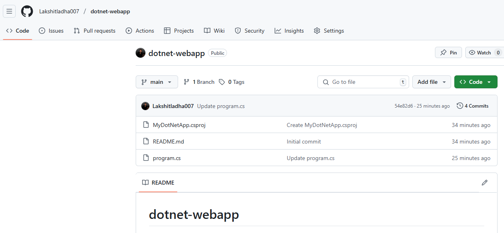
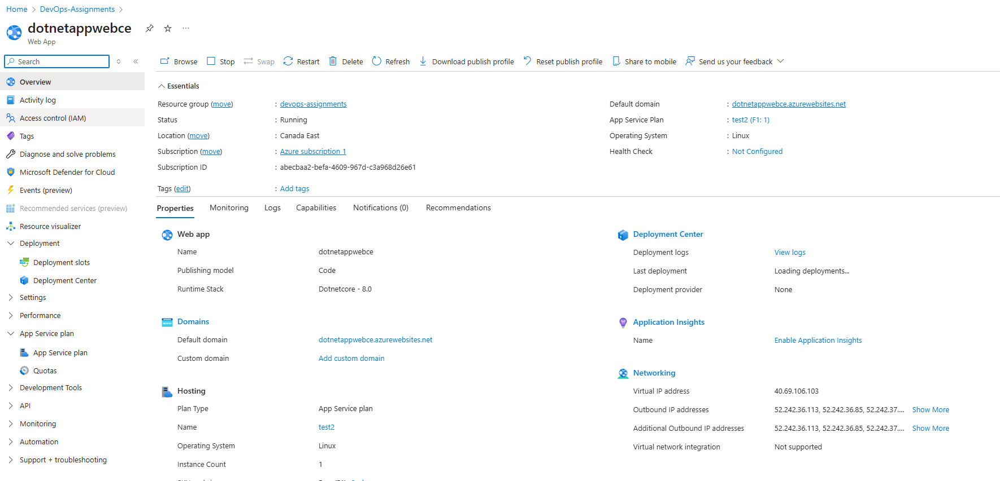
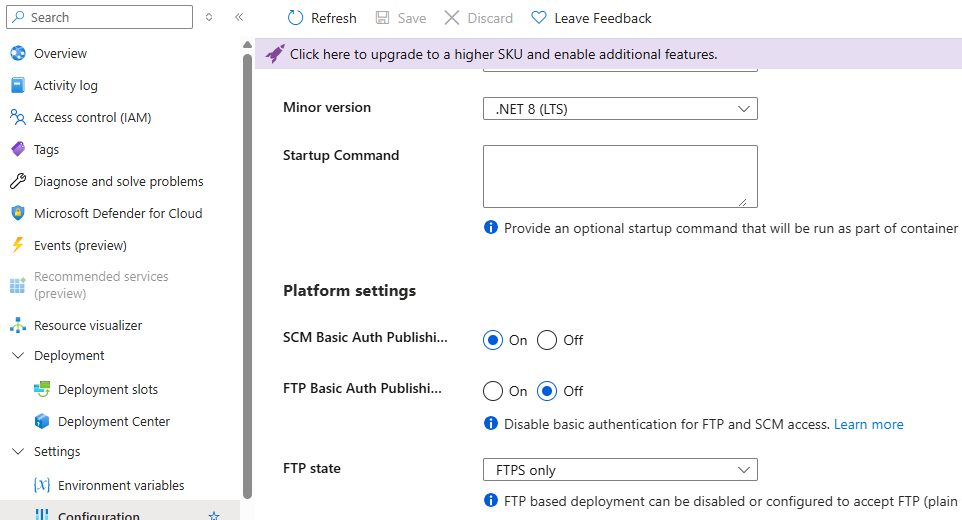
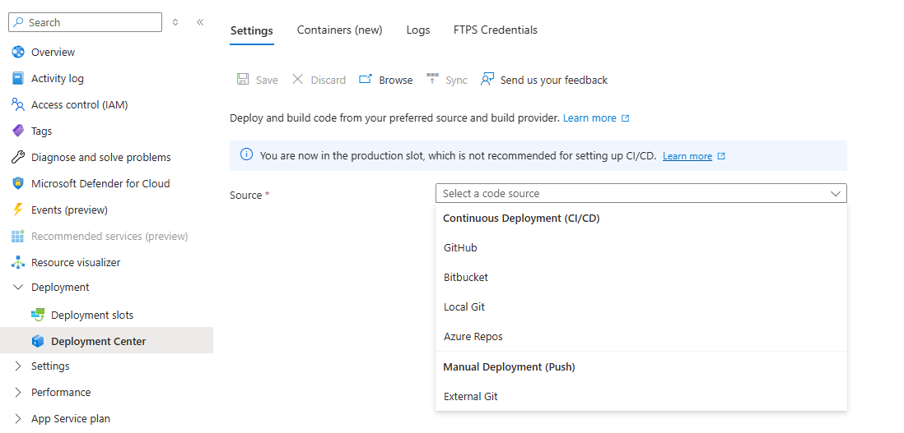
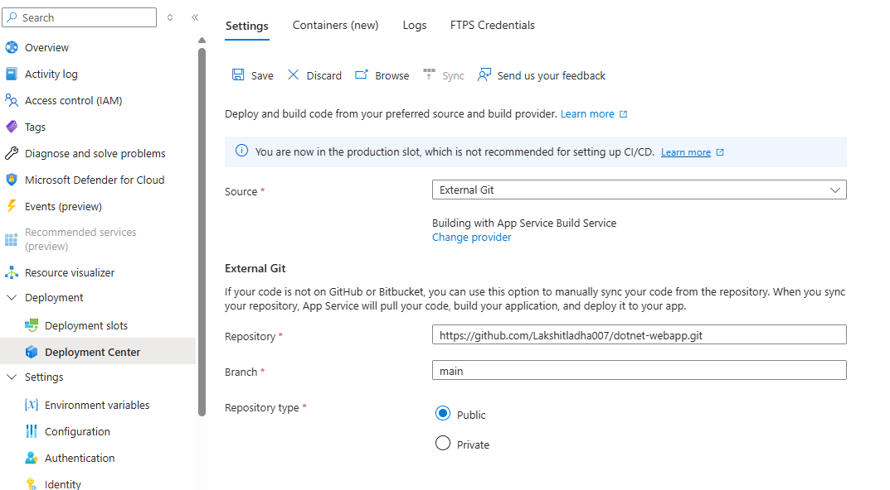
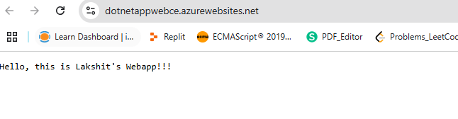

Steps:

1. On your github account, add the project folder that container the "dotnet" project files.
 

2. Now, go to Azure Portal, search for "app services". Now, click on "+ create", choose "web app", then configure by selecting subscription, resource group, webapp name, runtime stack, etc. Then click "review + create", and finally "create". 
 

3. Go to settings, under "configuration", go to Platform settings and chosse "on" for "SCM Basic Auth Publishing Credentials", and "save".

4. Now, once your resource is created, select the resource, and under deployment choose 'Deployment center'. Under, "manual deployment(Push)" select "external git", now add "repository url" and "branch name", choose repository type "public" or "private". And, finally, click on save.
 
 

5. Go to "app services", select the webapp resource that we created, now select "browse", and the webpage will be displayed in browser. You can see your webpage been hosted.
