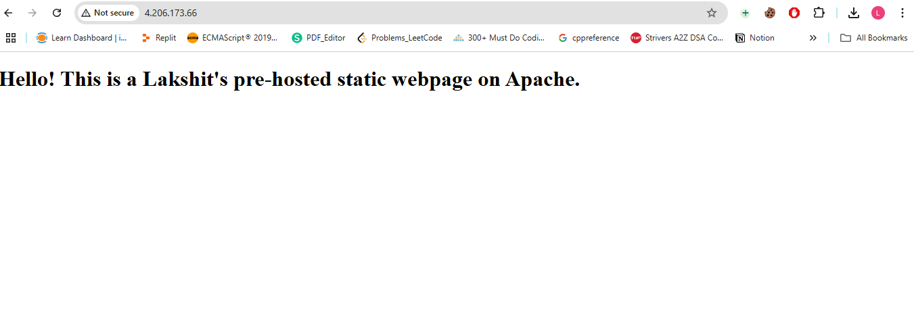
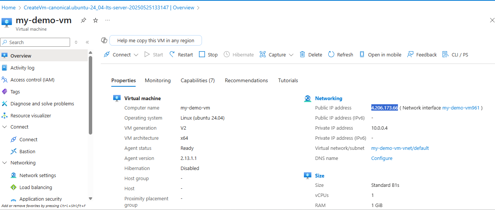
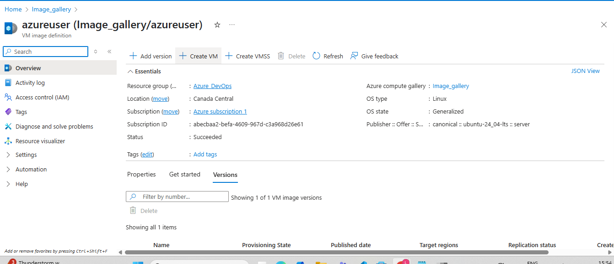
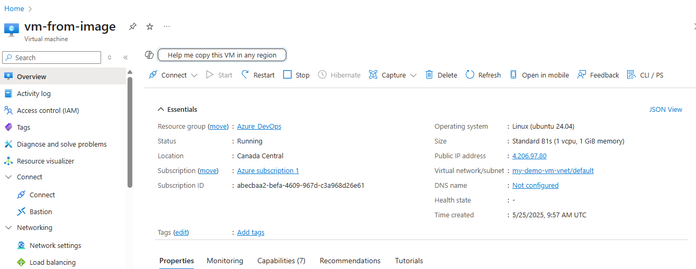
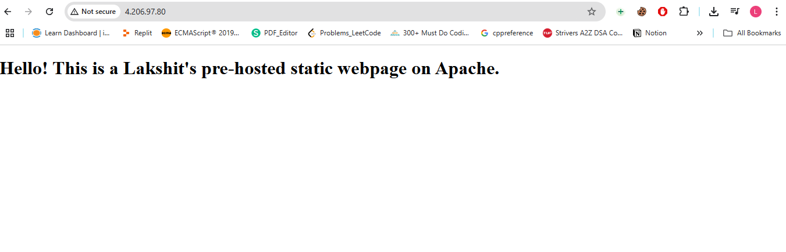

Steps:

1. Launch a Linux VM, choose a basic Ubuntu image (like Ubuntu 22.04 LTS).
Choose an instance type(Standard_B1s), make sure port 80 (HTTP) is allowed in the Security Group.

2. Find the “Advanced”, under "user-data" add the script:
```bash
#!/bin/bash
apt update -y

apt install apache2 -y

systemctl enable apache2
systemctl start apache2

cat <<EOF > /var/www/html/index.html
<!DOCTYPE html>
<html>
<head>
  <title>Welcome</title>
</head>
<body>
  <h1>Hello! This is a pre-hosted static webpage on Apache.</h1>
</body>
</html>
EOF
```

3. Finally, click on "review + create", then click on "create".
 

4. Get the Public IP of the VM, then Open http://<your-vm-public-ip> in your browser.
We can see the static webpage.



5. Now, stop your virtual machine and capture the VM Image, click Create Image.

6. Now, under "image gallery", find your image.<br>
 

> Now, click on "create VM", this will create the VM form the image. <br>
 

> Now, use the public address of this VM, and open http://<your-vm-public-ip> in your browser to verify whether the webpage is running or not.<br>
