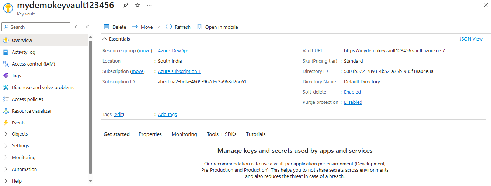
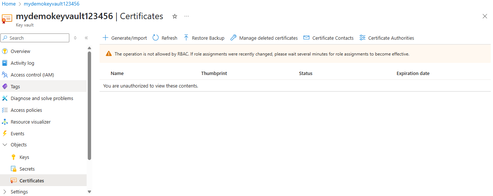
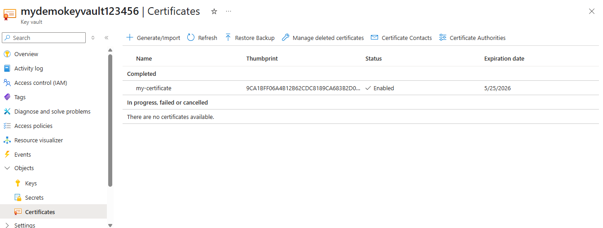
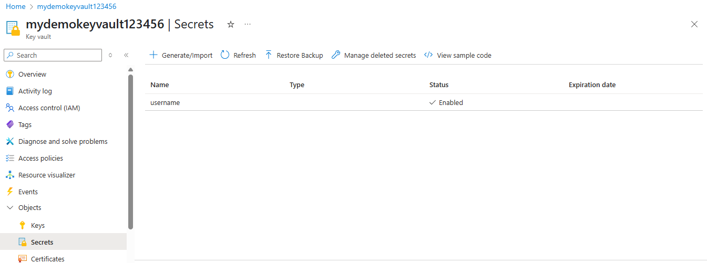

### Create an Azure Key Vault and store the following:

Steps:

1. Go to your azure portal, in the search bar at the top, type “Key Vaults” and select it. Click "+ Create", fill in the following info such as: Subscription, Resource Group, Key Vault Name, Region. Click "Review + Create", then Create.
 

2. Now, try creating a secret or certificate, but you will be denied as there are no permissions attached to the user to access this key-vault that we created.
 

3. Go to Access Control(IAM), and add the current user with required permissions to access the key-vault. 

#### 1. A certificate
Now, open the key-vault that we created and under objects select certificates, now click on generate and import, and fill in the detials and choose self signed certificate. And, finallly click on create. The certificate is created.

#### 2. A secret (e.g., a database connection string)
Now, open the key-vault that we created and under objects select secrets, click on generate/import secret. Add name of secret, it values, select resource group and subscritpion as well. And, finally click on create secret. You can verify that the secret is created.
 